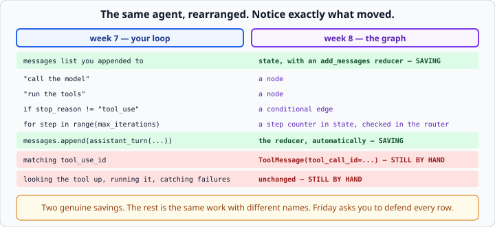

# Building an agent in LangGraph

*Week 8 · Day 3 · about 30 minutes*

> By the end of this, last week's agent runs as a LangGraph graph — and you can point at
> what moved where.

---

## Read the official documentation first

| Page | What it gives you |
|---|---|
| [**Agentic RAG / tool-calling agents**](https://langchain-ai.github.io/langgraph/agents/agents/) | The canonical agent graph |
| [**`add_messages` reducer**](https://langchain-ai.github.io/langgraph/concepts/low_level/#messagesstate) | The reducer built for message state |
| [**Prebuilt `ToolNode`**](https://langchain-ai.github.io/langgraph/reference/agents/) | The node you are choosing to write yourself |
| [**LangChain — Tools**](https://python.langchain.com/docs/concepts/tools/) | `@tool` and `.invoke()` |

> `langgraph.prebuilt.create_react_agent` builds a working agent in four lines. **It is
> fenced off this week**, and the reason is not purity: a comparison between *your loop*
> and *a function you called* teaches nothing. You will use it in your career, knowing
> exactly what it does — which is a completely different thing.

---

## The most valuable day of the week

You are not learning a new idea. You are watching one you already own get rearranged,
and noticing exactly what changes.



Keep that table. **Friday asks you to defend every row.**

---

## State for an agent

```python
from typing import Annotated, TypedDict
from langgraph.graph.message import add_messages

class AgentState(TypedDict):
    messages: Annotated[list, add_messages]
    steps: int
```

`add_messages` is the reducer built for this. It appends, and it handles a message being
**updated by id** rather than duplicated.

A node returning `{"messages": [reply]}` adds one message — it does not replace the
history. `operator.add` on a plain list would also append, but without the id handling,
and without coercing raw dicts into message objects.

`steps` has **no** reducer, so it is last-write-wins — which is what you want for a
counter you set explicitly.

**That is the first genuine saving.** Every `messages.append(...)` in week 7's loop is
now the reducer's job.

---

## The model node

```python
def call_model(state: AgentState) -> dict:
    """Send the history to the model and record its reply."""
    response = model.bind_tools(all_tools()).invoke(state["messages"])
    return {"messages": [response], "steps": state["steps"] + 1}
```

The whole of week 7's *"send the history, get a reply, append it"*.

Two lines. The appending is the reducer's job, and the history came in as state rather
than as a variable you were carrying.

Note it returns `[response]` — a list. The reducer merges lists.

---

## The tools node

```python
from langchain_core.messages import ToolMessage

def run_tools(state: AgentState) -> dict:
    """Run every tool the last message asked for."""
    last = state["messages"][-1]
    results = []
    for call in last.tool_calls:
        tool_function = tool_by_name(call["name"])
        if tool_function is None:
            content = f"Unknown tool: {call['name']}"
        else:
            try:
                content = str(tool_function.invoke(call["args"]))
            except Exception as error:
                content = f"Tool failed: {error}"
        results.append(ToolMessage(content=content, tool_call_id=call["id"]))
    return {"messages": results}
```

**Look closely at what did *not* change.**

You still look the tool up. You still run it. You still catch its failure and turn it
into a string. You still match the id by hand.

The framework did not take any of that away — it took away the **message plumbing
around it**. `ToolMessage(tool_call_id=...)` is your `tool_result` block: same id, same
rule, same bug if you get it wrong.

Every guardrail from week 7 Wednesday is still yours to write: unknown tools, failed
tools, truncation, repeat detection. LangGraph has opinions about *flow*, not about
*safety*.

> `langgraph.prebuilt.ToolNode` does this node for you. It is fenced this week for the
> same reason as `create_react_agent` — write it once, then use theirs knowing what it
> handles and what it does not.

---

## The router

```python
def route(state: AgentState) -> str:
    """Decide whether to run tools, or stop."""
    if state["steps"] >= MAX_STEPS:
        return END
    last = state["messages"][-1]
    if getattr(last, "tool_calls", None):
        return "tools"
    return END
```

Your `if stop_reason != "tool_use"`, plus the cap.

**The cap is still yours.** LangGraph has a `recursion_limit`, but it *raises* rather
than ending cleanly — and a production agent wants to finish with an answer, not a stack
trace. Two different jobs:

- `recursion_limit` — a safety net against a graph you wired wrong
- your `steps` check — a deliberate budget with a graceful ending

Note `getattr(last, "tool_calls", None)`. A `ToolMessage` has no `tool_calls` attribute,
so a plain `last.tool_calls` would raise if the router ever ran after the tools node.
Defensive, and cheap.

---

## Wiring it

```python
from langgraph.graph import StateGraph, START, END

graph = StateGraph(AgentState)
graph.add_node("model", call_model)
graph.add_node("tools", run_tools)

graph.add_edge(START, "model")
graph.add_conditional_edges("model", route, ["tools", END])
graph.add_edge("tools", "model")          # <- the loop

app = graph.compile()
```

**`graph.add_edge("tools", "model")` is the loop.** After tools run, go back to the
model. That one line is what `while` did.

Draw it and check:

```python
print(app.get_graph().draw_ascii())
```

### Running it

```python
result = app.invoke({"messages": [HumanMessage(question)], "steps": 0})
answer = result["messages"][-1].content
```

`invoke` returns the **final state**. The answer is the content of the last message, and
the whole conversation — including every tool call and result — is in
`result["messages"]`.

**That list is your week 7 trace**, and you did not write it. It is genuinely the
clearest thing the framework bought.

---

## What actually got shorter

Count the lines yourself; it is Friday's evidence. Roughly:

**Gone:**
- appending the assistant turn (the reducer)
- appending the results as a user message (the reducer)
- assembling the `tool_result` block dicts (`ToolMessage`)
- building the trace (the message list is the trace)
- the `for step in range(...)` scaffolding

**Still yours:**
- the tool dispatch table
- every guardrail — unknown tools, failures, truncation, repeats
- the step cap, if you want it to end gracefully
- matching tool call ids
- deciding what a tool returns

**New:**
- a state schema
- two node functions with a specific signature
- a routing function
- graph wiring
- a dependency

Whether that is a win depends entirely on what you build next. For this agent, roughly
break-even. For an agent with persistence and human approval steps — week 10 — the graph
wins clearly, and that is worth saying now.

---

## Three things that will catch you

**The last message is not always an `AIMessage`.** After the tools node it is a
`ToolMessage`. Any code assuming otherwise breaks the moment a tool runs — hence the
`getattr`.

**A node returning an un-declared key.** `{"trace": [...]}` when `trace` is not in the
`TypedDict` is silently dropped or raises, depending on version. Declare everything you
return.

**`bind_tools` inside the node, every call.** It is cheap but it is wasteful; bind once
outside and close over it, or store it on a class. Minor, and it will be noticed in
review.

---

## Check yourself

1. Which line makes the graph loop?
2. Why does `run_tools` still need its own `try`/`except`?
3. Why keep a `steps` counter when `recursion_limit` exists?
4. What is `result["messages"]` after a one-tool run?

<details>
<summary>Answers</summary>

1. `graph.add_edge("tools", "model")`. Without it the graph would end after the tools
   ran and the model would never see the result.
2. Because LangGraph runs your node; it does not wrap your tool. An exception inside
   `tool_function.invoke(...)` propagates out of the node and ends the graph run — the
   same failure as week 7, in a new place. **Frameworks manage flow, not safety.**
3. `recursion_limit` raises `GraphRecursionError`. Your counter returns `END` and the
   agent finishes with whatever it has. One is a crash barrier; the other is a budget.
4. Four messages: `HumanMessage`, `AIMessage` with `tool_calls`, `ToolMessage`,
   `AIMessage` with the answer. That is the trace, for free.
</details>

---

## What you can now do

- [ ] Declare agent state with `add_messages` and say what that reducer adds
- [ ] Write the model node and the tools node
- [ ] Say exactly which week 7 work the framework removed and which it did not
- [ ] Write a router that checks both `tool_calls` and a step cap
- [ ] Wire the loop with `add_edge("tools", "model")`
- [ ] Explain why `recursion_limit` is not a substitute for your own cap
- [ ] Read the answer and the trace out of the final state
- [ ] Produce a line-by-line account of what the port bought and cost

**Next:** [Streaming and debugging LangGraph](../day-4/streaming-and-debugging.md) —
seeing inside a graph while it runs.
