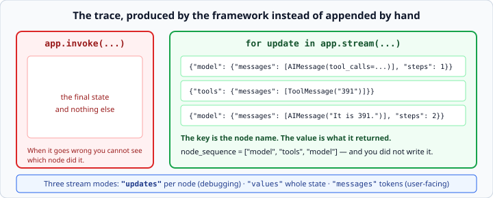

# Streaming and debugging LangGraph

*Week 8 · Day 4 · about 20 minutes*

> By the end of this you can watch a graph run step by step, and find a bug in one.

---

## Read the official documentation first

| Page | What it gives you |
|---|---|
| [**Streaming**](https://langchain-ai.github.io/langgraph/how-tos/streaming/) | Every stream mode |
| [**Graph API concepts**](https://langchain-ai.github.io/langgraph/concepts/low_level/) | What an "update" is |
| [**Visualising your graph**](https://langchain-ai.github.io/langgraph/how-tos/graph-api/#visualize-your-graph) | `draw_ascii` and friends |
| [**`GraphRecursionError`**](https://langchain-ai.github.io/langgraph/troubleshooting/errors/GRAPH_RECURSION_LIMIT/) | The error you will hit |

---

## A graph is harder to debug than a loop

You cannot put a `print` in the middle of an edge, and the code that decides what runs
next is in a different place from the code that runs.

What you get instead is **streaming and inspection** — and they are better, once you
know they exist.

---

## `stream` — one update per node

```python
for update in app.stream(initial_state):
    print(update)
```



`invoke` gives you the final state. `stream` gives you a dict per node as it finishes:

```python
{"model": {"messages": [AIMessage(...)], "steps": 1}}
{"tools": {"messages": [ToolMessage(...)]}}
{"model": {"messages": [AIMessage("It is 391.")], "steps": 2}}
```

**The key is the node's name. The value is exactly what that node returned.**

This is your week 7 trace, produced by the framework rather than appended by hand —
**the single clearest thing the framework bought you**, and worth saying it that way on
Friday.

### Turning it into a trace

```python
def node_sequence(app, state) -> list[str]:
    """Return the node names in the order they ran, repeats included."""
    return [name for update in app.stream(state) for name in update]
```

For a one-tool run that is `["model", "tools", "model"]`. Week 3's comprehension, and it
is the whole of week 7's trace machinery in one line.

```python
def node_updates(app, state) -> list[tuple[str, dict]]:
    """Return (node_name, update) pairs in order."""
    return [(name, payload) for update in app.stream(state)
            for name, payload in update.items()]
```

### The three stream modes

| Mode | Gives you | Use for |
|---|---|---|
| `"updates"` (default) | what each node returned | **debugging** |
| `"values"` | the whole state after each node | seeing state accumulate |
| `"messages"` | tokens as they are generated | a user-facing chat |

`"messages"` is week 6's streaming, now working through the graph. `"updates"` is the
one for today.

You can ask for several: `app.stream(state, stream_mode=["updates", "messages"])`.

---

## Drawing it

```python
print(app.get_graph().draw_ascii())
```

A picture of the wiring, from the graph itself — not from your memory of what you
intended.

Genuinely useful when a graph has grown past six nodes, and a good thing to paste into a
pull request. It also catches the class of bug where you *meant* to add an edge and
did not: the picture shows the node with nothing pointing at it.

---

## Where graph bugs live

| Symptom | Nearly always |
|---|---|
| a node runs twice | two edges point at it |
| state resets between nodes | a key with no reducer, being overwritten |
| the graph never ends | a router that never returns `END` |
| `KeyError` on the state | a node returned a key you did not declare |
| a router raises | it returned a node name that does not exist |
| `GraphRecursionError` | a loop with no exit, hitting the limit |

Two of those are worth expanding.

### "State resets between nodes"

You declared `log: list` instead of `log: Annotated[list, operator.add]`. Each node
overwrites, so the final log has one entry.

**The tell:** the result is the *last* node's contribution, not all of them. Same shape
as week 2's accumulator bug — a plausible wrong answer with no error.

### "The graph never ends"

Your router has a path that never returns `END`. It runs until `recursion_limit` (25 by
default) and then raises.

**The tell:** `GraphRecursionError`, and `node_sequence` shows the same two names
alternating twenty-five times. Print the sequence and the cycle is obvious in a second.

---

## A debugging method for graphs

Week 1's method, adapted.

**1. Print the node sequence first.**

```python
print(node_sequence(app, state))
```

Before anything else. It tells you *which nodes ran, in what order, how many times* —
and most graph bugs are visible right there.

**2. Then print the updates.**

```python
for name, payload in node_updates(app, state):
    print(f"{name}: {payload}")
```

Now you can see what each node actually returned, which is where reducer bugs show up.

**3. Test the node alone.**

```python
result = call_model({"messages": [HumanMessage("hi")], "steps": 0})
```

A node is a function. Call it with a dict. No graph, no compile, no model if you pass a
fake — week 6's dependency injection still paying off.

**4. Draw the graph** if the sequence is wrong in a way you cannot explain.

Then week 1's rule, unchanged: **change one thing.**

---

## The router runs after the node

This catches people, and it is one of today's exercises.

```python
graph.add_conditional_edges("increment", route, ["increment", END])
```

The router runs **after** `increment` has already executed. So by the time `route` reads
`state["count"]`, it has already been incremented.

If you want three visits, the condition is not `count < 3` — it is whatever is true
after the third run. Trace it by hand with the actual numbers:

| Visit | count after node | router sees | returns |
|---|---|---|---|
| 1 | 1 | 1 | continue |
| 2 | 2 | 2 | continue |
| 3 | 3 | 3 | stop |

So the condition is `count < 3` → continue, and that gives three visits. Off by one in
either direction gives two or four.

**This is week 1's boundary-checking**, in a place where it is less obvious that a
boundary exists. Trace it with real numbers rather than reasoning about it.

---

## What to record for Friday

You now have both agents, running the same task. Get the numbers:

```python
print(len(node_sequence(app, question_state)))     # graph steps
print(app.get_graph().draw_ascii())                # the wiring
```

And for the week 7 version, the trace you built by hand.

**Compare specifics, not impressions:**

- lines of code in each, counted
- what each one gives you when it fails
- how long it took to add one more tool to each
- what you would need to add to the week 7 version to match `stream`

That last one is the honest way to price the framework. Building your own per-node trace
is not hard — you did it in week 7 — but you *did* have to do it, and here you did not.

---

## Check yourself

```python
class State(TypedDict):
    log: list

def a(state): return {"log": ["a"]}
def b(state): return {"log": ["b"]}
```

Wired `START → a → b → END`, invoked with `{"log": []}`.

1. What is the final `log`?
2. What does `node_sequence` return?
3. A router returns `"modle"` by mistake. When do you find out, and how do you make that
   earlier?

<details>
<summary>Answers</summary>

1. `["b"]`. No reducer, so `b` overwrote `a`'s update. The fix is
   `Annotated[list, operator.add]`, and then it is `["a", "b"]`.
2. `["a", "b"]` — both nodes ran. **Note the sequence is right and the state is wrong**,
   which is exactly why you check both. The sequence tells you the wiring is fine, so the
   bug must be in the state declaration.
3. At **run time**, mid-execution — unless you passed the destination list as the third
   argument to `add_conditional_edges`, which makes it a build-time error. That is the
   whole argument for passing it.
</details>

---

## What you can now do

- [ ] Stream a graph and read the per-node updates
- [ ] Build a node sequence and a trace from the stream
- [ ] Choose between the `updates`, `values` and `messages` modes
- [ ] Draw a graph and spot an unconnected node
- [ ] Diagnose the six common graph symptoms
- [ ] Debug by printing the sequence, then the updates, then testing a node alone
- [ ] Reason correctly about a router that runs after its node
- [ ] Collect specific numbers for the week 8 comparison

**Next:** the week 8 milestone — both agents side by side, plus the comparison. That
write-up is one of the most useful things in your portfolio.
