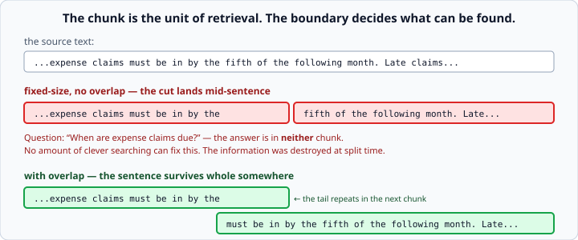
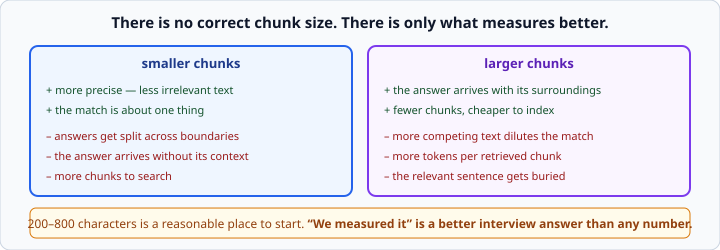

# Chunking strategies for RAG

*Week 9 · Day 1 · about 25 minutes*

> By the end of this you can split documents sensibly, and explain why the boundaries
> decide how well the whole system works.

---

## Read the official documentation first

| Page | What it gives you |
|---|---|
| [**`re` — Regular expressions**](https://docs.python.org/3.14/library/re.html) | `re.split` and lookbehind |
| [**Regular Expression HOWTO**](https://docs.python.org/3.14/howto/regex.html) | The gentler introduction |
| [**LangChain — Text splitters**](https://python.langchain.com/docs/concepts/text_splitters/) | The strategies, named — you are writing them, not importing them |
| [**Contextual retrieval**](https://www.anthropic.com/news/contextual-retrieval) | What good chunking looks like at the current state of the art |

---

## Why chunk at all

You cannot put a whole document library in a prompt. So you cut it into pieces, find the
pieces that look relevant, and put only those in.

Which means **the chunk is the unit of retrieval.**

You never retrieve "the bit that answers the question" — you retrieve a **chunk**, and
either the answer is inside it or it is not. Every decision about chunk boundaries is a
decision about what can be found.

**Chunking is the most consequential and least glamorous part of RAG.** People spend
weeks tuning prompts and rerankers on top of a splitter that destroyed the answer before
anything else ran.

---

## Fixed-size chunking

```python
def fixed_chunks(text: str, size: int = 400) -> list[str]:
    """Split text into consecutive slices of `size` characters."""
    return [text[i:i + size] for i in range(0, len(text), size)]
```

Week 2's slicing and week 3's comprehension. Simple, predictable — and it cuts sentences
in half.



A chunk ending *"...claims must be in by the"* and the next starting *"fifth of the
following month"* means the answer to *"when are claims due"* is in **neither** chunk.

No amount of clever searching will find it. **The information was destroyed at split
time**, and every layer above is now working on damaged input.

That is the single most important idea today.

---

## Overlap

```python
def fixed_chunks_with_overlap(text: str, size: int = 400,
                              overlap: int = 80) -> list[str]:
    """Split into slices where each repeats the tail of the one before."""
    if overlap >= size:
        raise ValueError("Overlap must be smaller than size")

    chunks = []
    start = 0
    while start < len(text):
        chunks.append(text[start:start + size])
        start += size - overlap
    return chunks
```

Each chunk repeats the last bit of the one before, so **a sentence cut in half appears
whole somewhere**.

It costs storage and it duplicates text in results, and it is usually worth it. Twenty
percent of the chunk size is a common starting point.

### Watch the arithmetic

`start += size - overlap`. **If `overlap >= size`, `start` never advances** and you have
an infinite loop that fills memory until the process dies.

That is a real bug people ship, which is why the guard clause is the first line. Week 3's
habit — handle the awkward case first, with a message that names the rule.

Note the message says what the rule *is*, not just that something is wrong.

---

## Splitting on sentences

Better still: cut where the text already cuts.

```python
import re

def split_sentences(text: str) -> list[str]:
    """Split text into sentences, keeping the terminating punctuation."""
    return [s.strip() for s in re.split(r"(?<=[.!?])\s+", text) if s.strip()]
```

`(?<=[.!?])` is a **lookbehind**: split *after* a full stop, question mark or
exclamation mark, keeping the punctuation with the sentence it ends. `\s+` consumes the
whitespace.

Then group sentences up to a size limit, carrying the last one or two into the next
group as overlap:

```python
def sentence_chunks(text: str, size: int = 400, overlap_sentences: int = 1) -> list[str]:
    """Group sentences into chunks of about `size` characters, with sentence overlap."""
    sentences = split_sentences(text)
    chunks, current = [], []

    for sentence in sentences:
        current.append(sentence)
        if sum(len(s) for s in current) >= size:
            chunks.append(" ".join(current))
            current = current[-overlap_sentences:] if overlap_sentences else []

    if current:
        chunks.append(" ".join(current))
    return chunks
```

Week 2's accumulator, twice over. Before, inside, after — and note the final `if
current`, which is the "don't lose the last partial group" case that people forget.

**This is better because sentences are where meaning already ends.** A chunk that starts
and stops at sentence boundaries is a chunk a human could read.

### It is not perfect

`"Dr. Smith"` will fool it. So will `"e.g."`, `"3.5"`, and abbreviations generally.

For this week that is fine. **Knowing the limitation is worth more than avoiding it** —
and being able to say "my splitter breaks on abbreviations, here is the case" is a much
better answer than pretending it does not.

---

## Structural chunking

The best splitter uses the structure the document already has.

- **Markdown** — split on `##` headings; each section is a coherent chunk
- **Code** — split on function or class boundaries
- **CSV or logs** — split on rows
- **HTML** — split on `<section>` or `<article>`

```python
def markdown_sections(text: str) -> list[str]:
    """Split markdown on level-2 headings, keeping each heading with its section."""
    parts = re.split(r"\n(?=## )", text)
    return [p.strip() for p in parts if p.strip()]
```

`(?=## )` is a **lookahead** — split *before* the heading, so each chunk starts with its
own title.

That detail matters more than it looks: a chunk carrying its heading tells the retriever
*and the model* what it is about. It is a free, cheap version of the "contextual
retrieval" idea in the Anthropic link above, where each chunk is prefixed with a
sentence explaining where it came from.

**Always prefer a boundary the document gives you over one you impose.**

---

## There is no correct chunk size



| Smaller chunks | Larger chunks |
|---|---|
| more precise — less irrelevant text | more context — the answer arrives with its surroundings |
| answers get split across boundaries | more competing text dilutes the match |
| more chunks to search | fewer, cheaper |

Somewhere between **200 and 800 characters** is a reasonable place to start.

**The right answer is whichever one measures better on your documents**, which is
Thursday — and *"we measured it"* is a much better interview answer than any number.

Be suspicious of anyone who gives you a chunk size without asking what your documents
look like. A chunk size that works for support tickets will not work for legal contracts.

---

## Keep the metadata

```python
chunks.append({
    "text": chunk_text,
    "source": filename,
    "index": i,
})
```

**Chunks without provenance are useless.** When your system answers a question, the user
wants to know *where it got that*, and on Wednesday you will build citations out of
exactly this.

Keep at minimum the source document and the position. Add a heading if you have one.

Losing this is a rewrite, not a patch, so do it from the first version.

---

## Check yourself

```python
text = "Claims are due on the fifth. Late claims need approval. Approval takes a week."
```

1. What does `fixed_chunks(text, size=30)` produce?
2. Which chunk answers "when are claims due"?
3. What does `split_sentences(text)` produce?
4. Why does `fixed_chunks_with_overlap(text, size=50, overlap=50)` need a guard?

<details>
<summary>Answers</summary>

1. `['Claims are due on the fifth. La', 'te claims need approval. Approv', ...]` —
   sentences cut mid-word.
2. The first, but only just: `"Claims are due on the fifth."` survives because the cut
   fell after it. Move the size by ten characters and it does not. **That fragility is
   the point.**
3. `['Claims are due on the fifth.', 'Late claims need approval.', 'Approval takes a
   week.']` — three clean chunks, each answering a different question.
4. `start += 50 - 50` is `start += 0`. The loop appends the same chunk forever until
   memory runs out. Without the guard there is no error message — just a program that
   hangs.
</details>

---

## What you can now do

- [ ] Explain why the chunk is the unit of retrieval
- [ ] Write fixed-size chunking and say what it destroys
- [ ] Add overlap, with a guard against a non-advancing loop
- [ ] Split on sentences with a lookbehind, and name the cases it gets wrong
- [ ] Group sentences into size-bounded chunks with overlap
- [ ] Split on document structure, keeping headings with their sections
- [ ] State the small-versus-large trade-off without giving a magic number
- [ ] Keep source and position metadata on every chunk

**Next:** [Embeddings and vector similarity](../day-2/embeddings-and-similarity.md) —
turning text into numbers you can compare.
