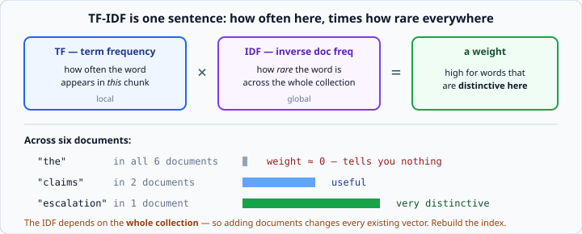
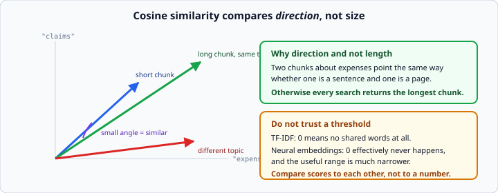

# Embeddings and vector similarity

*Week 9 · Day 2 · about 25 minutes*

> By the end of this you can turn text into a vector, say how alike two vectors are, and
> search a collection of them.

---

## Read the official documentation first

| Page | What it gives you |
|---|---|
| [**Embeddings — Anthropic docs**](https://docs.claude.com/en/docs/build-with-claude/embeddings) | What an embedding is and where to get one |
| [**`math` (Python)**](https://docs.python.org/3.14/library/math.html) | `sqrt` and `log`, which TF-IDF and cosine need |
| [**`collections.Counter`**](https://docs.python.org/3.14/library/collections.html#collections.Counter) | Counting words — the counting pattern from week 2, built in |
| [**LangChain — vector stores**](https://python.langchain.com/docs/concepts/vectorstores/) | The interface every real store implements |

---

## A vector is a list of numbers standing in for a piece of text

That is the entire idea.

```python
from retrieval_kit import inverse_document_frequencies, embed, cosine_similarity

idf = inverse_document_frequencies([chunk["text"] for chunk in chunks])
vector = embed("expense claims are due on the fifth", idf)
# {"expense": 0.31, "claims": 0.28, "due": 0.19, ...}
```

This course's version is a **dict of word to weight**, because that is easy to look
inside. A real embedding model gives you a fixed-length list of a thousand-odd floats
that mean nothing individually.

**Everything else on this page works identically either way** — which is exactly why the
course uses the transparent one.

> ### Why TF-IDF and not a neural model
>
> `retrieval_kit.py` uses **TF-IDF**. It is a real retrieval method, it is
> deterministic, and it needs no key, no model download and no network — so every number
> you produce this week is reproducible on any machine, including your instructor's.
>
> **The honest difference: TF-IDF matches words. A neural embedding matches meaning.**
> A question phrased with none of the passage's words is found by an embedding model and
> missed by TF-IDF, and you will watch exactly that happen on Thursday.
>
> What does **not** change when you swap them: chunking, the store interface, top-k,
> prompt construction, citations, and every evaluation number you compute. That is most
> of the system.

---

## Why the weights are not just counts

A word appearing in **every** document tells you nothing. "the" is in all six of ours.

A word appearing in **one** document tells you a lot — "escalation" only appears in the
on-call notes.



That is what `inverse_document_frequencies` measures: how rare a word is across the
whole collection. Multiply by how often it appears in this chunk, and you get a weight
that is high for **distinctive** words.

**TF-IDF is nothing more than that sentence.** Term frequency times inverse document
frequency. Local importance times global rarity.

### A consequence people trip over

**The IDF depends on the whole collection.** Add documents and every existing vector's
weights change, because the rarity of every word has changed.

So: **rebuild the index when the collection changes.** A store where old vectors were
built against an old IDF and new ones against a new one is quietly, subtly wrong — the
scores are not comparable and nothing tells you.

Neural embeddings do not have this property; each text embeds independently. It is one
of the genuine advantages, and worth knowing as a difference rather than a detail.

---

## Cosine similarity

```python
cosine_similarity(query_vector, chunk_vector)     # 0.0 to 1.0
```



It compares **direction, not size**.

Two chunks about expenses point the same way whether one is a sentence or a page — which
is exactly what you want. Without it, every search would just return the longest chunk,
because a longer chunk contains more of every word.

### Do not build on a threshold

Zero means no shared words at all. In a neural embedding, **zero effectively never
happens**, and the useful scores live in a much narrower band — two unrelated sentences
might score 0.7.

So `if score > 0.5: it's relevant` is a rule that works on your data and breaks the day
you change the embedding model.

**Compare scores to each other, not to a number.** Take the top k. If you must have a
cut-off, derive it from the distribution — "within 80% of the best score" survives a
model change; "above 0.5" does not.

---

## A vector store is a list

```python
class VectorStore:
    """A tiny in-memory vector store: add chunks, search them."""

    def __init__(self) -> None:
        self.chunks: list[dict] = []
        self.vectors: list[dict] = []
        self.idf: dict = {}

    def add(self, chunks: list[dict]) -> None:
        """Add chunks and rebuild the index."""
        self.chunks.extend(chunks)
        self.idf = inverse_document_frequencies([c["text"] for c in self.chunks])
        self.vectors = [embed(c["text"], self.idf) for c in self.chunks]

    def search(self, query: str, k: int = 3) -> list[dict]:
        """Return the top k chunks by cosine similarity, best first."""
        query_vector = embed(query, self.idf)
        scored = [
            {**chunk, "score": cosine_similarity(query_vector, vector)}
            for chunk, vector in zip(self.chunks, self.vectors)
        ]
        return sorted(scored, key=lambda r: r["score"], reverse=True)[:k]
```

Week 2's `zip`, week 3's comprehension and `key=`, week 4's class. Nothing here is new
except the vocabulary.

Note `add` rebuilds **everything** — that is the IDF consequence above, made concrete.
It is O(n) per add and completely fine for six documents.

Search is: embed the query, score everything, sort, take the top few. **A linear scan**,
and for six documents it is instant.

### Why real vector databases exist

A linear scan over ten million chunks is not instant. Chroma, FAISS, pgvector and
Pinecone use an **approximate** index — deliberately trading a little accuracy for a lot
of speed.

**The interface is the same as yours: add things, search things.** When you meet one,
this is what it is doing — faster and less exactly.

That "less exactly" is worth knowing. An approximate index can miss the true best match.
For most applications that is an excellent trade; for some it is not, and knowing there
*is* a trade puts you ahead.

---

## Top-k

```python
results = store.search(question, k=3)
```

**How many is `k`?**

Too few and the answer is not there. Too many and the real answer is buried among
near-misses — that is **context stuffing**, and it makes answers *worse* while looking
like it should make them better.

That last point is counter-intuitive enough to be worth stating plainly: **adding more
retrieved context can reduce answer quality.** More text means more chances for the
model to latch onto something almost-relevant, and more tokens on every call.

Three to five is a sensible starting point. Like chunk size, the honest answer is
whichever measures better — which is Thursday.

---

## What you would swap in

```python
# this week
vector = embed(text, idf)

# a real system
response = client.embeddings.create(model=..., input=text)
vector = response.embedding
```

Then `cosine_similarity` on two lists of floats instead of two dicts. Everything above
it — the store, the search, top-k, the whole of Wednesday and Thursday — is unchanged.

Two practical differences worth knowing before you meet one:

- **Embedding calls cost money and take time.** You embed each chunk once at index time
  and cache the result. Re-embedding a corpus on every startup is a classic and
  expensive mistake.
- **Query and documents must use the same model.** Vectors from different models are not
  comparable at all, and mixing them produces plausible-looking nonsense.

---

## Check yourself

```python
chunks = ["expense claims are due on the fifth",
          "the on-call escalation path is documented here",
          "the fifth floor has a printer"]
```

1. Which chunk does "when are claims due" match best, and why?
2. Which does "who do I escalate to" match, with TF-IDF?
3. What is the weight of "the" likely to be?
4. You add 100 more documents. What must you do to the existing vectors?

<details>
<summary>Answers</summary>

1. The first — it shares "claims" and "due", both rare across the collection.
2. **None of them, well.** "escalate" is not "escalation" — TF-IDF matches words, and
   these are different words. A neural embedding would find chunk 2 easily. **This is
   Thursday's lesson arriving early**, and it is the clearest demonstration of the
   difference you will get.
3. Near zero. It appears in most chunks, so its IDF is tiny.
4. **Rebuild them all.** The IDF changed, so every existing weight is now computed
   against a stale rarity. Nothing will error; the scores will just quietly stop being
   comparable.
</details>

---

## What you can now do

- [ ] Explain what a vector is and why it stands in for text
- [ ] State what TF-IDF computes, in one sentence
- [ ] Say why adding documents invalidates existing vectors
- [ ] Explain what cosine similarity compares and why not length
- [ ] Say why a fixed score threshold is fragile
- [ ] Build a vector store as a list, with `add` and `search`
- [ ] Say what a real vector database does differently, and what it trades
- [ ] Explain context stuffing and why more retrieved text can be worse
- [ ] Name what changes and what does not when swapping in a neural embedding

**Next:** [RAG prompt construction](../day-3/rag-prompt-construction.md) — putting the
retrieved chunks in front of the model.
