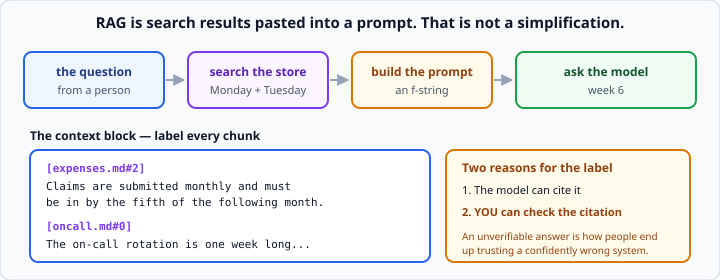
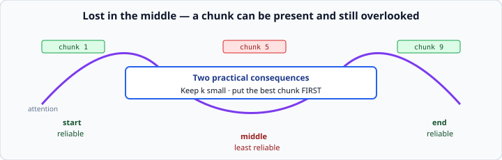

# RAG prompt construction

*Week 9 · Day 3 · about 20 minutes*

> By the end of this you can answer a question from your documents, cite where the
> answer came from, and refuse to answer when it is not there.

---

## Read the official documentation first

| Page | What it gives you |
|---|---|
| [**Reduce hallucinations**](https://docs.claude.com/en/docs/test-and-evaluate/strengthen-guardrails/reduce-hallucinations) | Grounding, and telling it to say "I don't know" |
| [**Use XML tags**](https://docs.claude.com/en/docs/build-with-claude/prompt-engineering/use-xml-tags) | Fencing the retrieved context |
| [**Long context tips**](https://docs.claude.com/en/docs/build-with-claude/prompt-engineering/long-context-tips) | Where to put documents in a long prompt |
| [**Contextual retrieval**](https://www.anthropic.com/news/contextual-retrieval) | The current state of the art, and worth reading twice |

---

## RAG is search results pasted into a prompt

Monday and Tuesday were the retrieval half. Today is the generation half, and it is much
shorter than people expect.



```
question -> search the store -> put the top chunks in a prompt -> ask the model
```

Four steps. Two of them you built already, one is an f-string, and one is week 6.

**That is not a simplification.** People are frequently disappointed to learn there is
no more to it. Everything sophisticated in RAG is a refinement of one of those four
boxes — and almost all of the refinement worth doing is in the first two, which is why
this week spent two days there.

---

## The context block

```
[expenses.md#2]
Claims are submitted monthly and must be in by the fifth of the following month.

[oncall.md#0]
The on-call rotation is one week long...
```

**Label every chunk with where it came from.** Two reasons, and the second is the
important one:

1. The model can cite it.
2. **You** can check the citation.

A RAG answer without sources is unverifiable, and unverifiable answers are how people
end up trusting a confidently wrong system. **The label is the whole difference between
a research tool and a plausible-nonsense generator.**

```python
def build_context(results: list[dict]) -> str:
    """Format retrieved chunks with source labels."""
    return "\n\n".join(
        f"[{r['source']}#{r['index']}]\n{r['text']}"
        for r in results
    )
```

That `source` and `index` are the metadata you were told to keep on Monday. This is
where it pays.

---

## The prompt

```python
SYSTEM = """Answer the question using ONLY the context provided.

Rules:
- Cite the source of every fact, like [expenses.md#2]
- If the context does not contain the answer, say exactly:
  "I don't know based on the documents I have."
- Do not use anything you know from outside the context."""


def build_prompt(question: str, results: list[dict]) -> str:
    return f"""<context>
{build_context(results)}
</context>

Question: {question}"""
```

Week 6's fencing habit, and it matters more here than anywhere: the context is
**untrusted text from documents**, and a document containing "ignore your instructions"
is a real attack on a RAG system. The `<context>` tags are the boundary.

### The rule models find hardest

> *Do not use anything you know from outside the context.*

A model asked about expense policy will happily supply a **plausible general answer**
about expense policy. That is worse than no answer, because it looks exactly like a real
one — same tone, same confidence, and it may even be right for some other company.

Three things that help:

- **Say "ONLY"**, in capitals, and say it twice in different words.
- **Give the exact refusal sentence.** A recognisable string is something you can test
  for; "say you don't know" produces twelve different phrasings.
- **Require citations.** A model that has to name a source for every fact finds it much
  harder to invent one, and you can check.

---

## Refusing is a feature

Two places to enforce it.

**In the prompt** — the exact sentence above.

**In your code, before you call the model at all:**

```python
results = store.search(question, k=3)
if not results or results[0]["score"] < min_score:
    return {"answer": "I don't know based on the documents I have.", "sources": []}
```

If the top result scores near zero, there is nothing worth sending. That check:

- saves a call and the money
- removes the chance the model invents something from a context of noise
- is faster, which matters when most questions are out of scope

**Do not lean on a fixed threshold with a real embedding model**, where scores sit in a
much narrower band — Tuesday's warning applies exactly. Compare to the other scores, or
to the distribution, rather than to a constant.

### Why this matters more than it sounds

A system that answers everything is a system nobody can trust, because the user cannot
tell the grounded answers from the invented ones.

A system that says "I don't know" for the 30% it does not cover is one you can rely on
for the other 70%. **The refusal is what makes the rest of the answers worth having.**

That is a genuinely good thing to say in an interview, and it is true.

---

## Lost in the middle

Models attend most reliably to the **start and end** of a long context, and least
reliably to the middle.



So a chunk ranked third of nine can be present and still overlooked. The retrieval
worked and the answer is still wrong — which is a maddening failure to debug if you do
not know the effect exists.

Two practical consequences:

**Keep `k` small.** Three good chunks beat nine mediocre ones, and this is another
reason why — beyond token cost.

**Put the best chunk first.** Yours are already sorted best-first, which is not an
accident.

For long documents, the official long-context guidance is to put them near the **top** of
the prompt and the question at the **bottom**. Worth knowing when your context grows.

---

## Returning sources separately

```python
def answer(client, store, question: str, k: int = 3) -> dict:
    """Answer from the corpus, with sources. Refuses when nothing relevant is found."""
    results = store.search(question, k=k)
    if not results or results[0]["score"] <= 0:
        return {"answer": "I don't know based on the documents I have.", "sources": []}

    response = client.messages.create(
        model=MODEL,
        max_tokens=1000,
        system=SYSTEM,
        messages=[{"role": "user", "content": build_prompt(question, results)}],
    )
    return {
        "answer": extract_text(response),
        "sources": [f"{r['source']}#{r['index']}" for r in results],
    }
```

**Return the sources as data**, not only as text inside the answer. Then a user
interface can render them as links, and — more importantly — you can check whether the
model cited something it was actually given.

That check is worth building:

```python
cited = set(re.findall(r"\[([^\]]+)\]", result["answer"]))
invented = cited - set(result["sources"])
if invented:
    print(f"Warning: cited sources not in context: {invented}")
```

A model citing `[expenses.md#7]` when you only gave it `#2` has invented a citation,
which is the most dangerous hallucination of all — it looks like evidence.

---

## What this does not fix

RAG grounds the model in your documents. It does not:

- **make the documents correct** — garbage in, cited garbage out
- **stop the model misreading** a chunk it was given
- **find an answer that is not in any chunk** — that is Monday's problem, not today's
- **guarantee the citation is the right one** — hence the check above

The single most useful thing to internalise: **if the passage was never retrieved, no
prompt engineering can save the answer.** Which is exactly why tomorrow measures
retrieval separately from generation.

---

## Check yourself

1. Why label chunks with their source, beyond letting the model cite?
2. Why check the top score before calling the model?
3. Your retrieval returns the right chunk fifth of nine, and the answer is still wrong.
   What is happening?
4. The answer cites `[oncall.md#4]` and you only supplied `#0`. What has happened?

<details>
<summary>Answers</summary>

1. So **you** can verify it. A citation you cannot check is decoration.
2. It saves a call and money, and it removes the chance of the model confabulating from
   irrelevant context. An out-of-scope question should cost nothing.
3. **Lost in the middle.** The chunk is in the prompt and the model under-attended to
   it. Reduce `k` and make sure the best chunk is first.
4. The model **invented a citation**. That is the most dangerous failure mode, because
   it looks like evidence. Check cited sources against what you supplied.
</details>

---

## What you can now do

- [ ] Describe RAG in four steps without hedging
- [ ] Build a labelled context block from retrieved chunks
- [ ] Fence the context and say why that matters for untrusted documents
- [ ] Write a system prompt with a fixed, testable refusal sentence
- [ ] Refuse in code before calling the model, without a fragile threshold
- [ ] Explain lost-in-the-middle and its two consequences
- [ ] Return sources as data and verify the model's citations against them
- [ ] Say what RAG does not fix

**Next:** [Evaluating retrieval](../day-4/evaluating-retrieval.md) — putting a number on
it, which almost nobody does.
