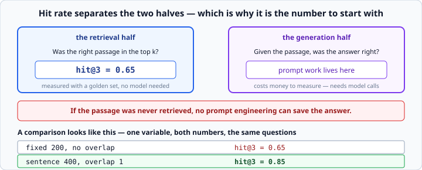

# Evaluating retrieval

*Week 9 · Day 4 · about 25 minutes*

> By the end of this you can put a number on your retrieval, change something, and prove
> the number moved.

---

## Read the official documentation first

| Page | What it gives you |
|---|---|
| [**Create strong empirical evaluations**](https://docs.claude.com/en/docs/test-and-evaluate/develop-tests) | How to build an eval set |
| [**Define your success criteria**](https://docs.claude.com/en/docs/test-and-evaluate/define-success) | Choosing what to measure |
| [**pytest — parametrize**](https://docs.pytest.org/en/stable/how-to/parametrize.html) | Running a golden set as tests |
| [**`statistics` (Python)**](https://docs.python.org/3.14/library/statistics.html) | `mean`, for summarising results |

---

## This is the week

Everything before today was building the thing. Today is the part almost nobody does,
and it is the part that gets discussed in interviews.

Most RAG projects have **zero** measurement. Every claim about quality is a feeling, and
every change is a guess. You are about to be able to say something better than that.

---

## The golden set

A list of questions, each with the answer you know is in the corpus:

```python
GOLDEN = [
    ("when must expense claims be submitted", "fifth of the following month"),
    ("how long is the on-call rotation", "one week"),
    ...
]
```

**Writing one of these for your own corpus is the highest-value afternoon you can spend
on a RAG system**, and it is unglamorous enough that most teams never do it.

Twenty is enough to be useful. A hundred is better. Zero — which is where most projects
are — means every claim about quality is a feeling.

### How to write one

**Ask real questions.** Not "what does the expenses document say" — the questions people
actually type, in the words they actually use. Wrong phrasing in a golden set makes it
useless, because you will optimise for questions nobody asks.

**Include the ones you expect to fail.** A set of easy questions gives you 1.0 and tells
you nothing. The value is in the boundary.

**Include out-of-scope questions**, with the expected answer being the refusal. A system
that answers everything is a system that will confidently answer things it should not.

**Store the expected *passage text*, not the expected answer.** You are measuring
retrieval — whether the right chunk came back — and that is checkable without calling a
model at all.

---

## Hit rate at k

> Of the questions, in what fraction did the right passage appear in the top `k`?

```python
def hit_rate(store, golden: list[tuple], k: int = 3) -> float:
    """Fraction of golden questions whose expected text appears in the top k results."""
    hits = 0
    for question, expected in golden:
        results = store.search(question, k=k)
        if any(expected.lower() in r["text"].lower() for r in results):
            hits += 1
    return round(hits / len(golden), 3)
```

Fifteen lines, and it turns *"the retrieval seems fine"* into `0.65`.



**It is the single most useful number in a RAG system because it separates the two
halves.** If the passage was never retrieved, no prompt engineering can save the answer —
so you know immediately which half to work on.

It also costs **nothing to run**. No model calls, no money, no waiting. You can run it on
every commit, which means you can run it as a test:

```python
def test_retrieval_quality(store):
    assert hit_rate(store, GOLDEN, k=3) >= 0.80
```

That is week 4's testing, pointed at a thing most people believe cannot be tested.

---

## Why this metric and not another

You will meet **precision**, **recall**, **MRR** and **NDCG**. They are all worth
knowing.

| Metric | Answers |
|---|---|
| **hit@k** | did the right passage appear at all in the top k? |
| **precision@k** | what fraction of the k returned were relevant? |
| **recall@k** | what fraction of all relevant passages did we get? |
| **MRR** | how high up was the first relevant one? |

Hit rate at k is the right one to start with because **it maps exactly onto what your
system does**: it fetches `k` chunks and puts them in a prompt. If the answer is in those
`k`, the generation step has a chance. If not, it does not.

**Measure the thing your system actually does.** A sophisticated metric measuring
something else is worse than a crude one measuring the right thing — and that sentence is
worth remembering well beyond RAG.

MRR becomes interesting once lost-in-the-middle matters: a passage at rank 1 is more
useful than the same passage at rank 5, and hit@k treats them the same.

---

## Changing one thing at a time

```
fixed 200, no overlap      hit@3 = 0.65
sentence 400, overlap 1    hit@3 = 0.85
```

That is what a comparison looks like: **one variable, both numbers, the same questions.**

Change the chunking **and** `k` at once and you have learned nothing about either. This
is the same discipline as week 1's debugging rule — change one thing — and it is the same
reason.

Run a sweep and put it in a table:

```python
for size in (200, 400, 800):
    for k in (1, 3, 5):
        store = build_store(chunk_size=size)
        print(f"size={size} k={k}  hit@k={hit_rate(store, GOLDEN, k=k)}")
```

**That table is Friday's deliverable**, and it is the answer to "how did you choose 400?"
It is also the reason "we measured it" beats any number someone quotes you.

### Watch for the k trap

Hit rate rises with `k` almost by definition — with `k` = every chunk it is 1.0.

So **never compare hit@5 with hit@3 and call it an improvement.** Hold `k` fixed when
comparing chunking, and when you do vary `k`, remember that a bigger `k` costs tokens and
makes lost-in-the-middle worse. The best `k` is not the one with the highest hit rate.

---

## Reading the failures

The number tells you *whether*. **The failure list tells you *why*, and it is where the
work actually is.**

```python
def failures(store, golden, k=3) -> list[str]:
    """Return the questions whose expected passage did not appear in the top k."""
    return [
        question
        for question, expected in golden
        if not any(expected.lower() in r["text"].lower()
                   for r in store.search(question, k=k))
    ]
```

```
missed: I accidentally pushed a password to git, what now
missed: what happens if I ignore the pager
```

Look at those two. **Neither shares many words with the passage that answers it** — the
document says "rotate the credential", the question says "pushed a password".

**No amount of chunking fixes that**, because TF-IDF matches words and the words are not
shared.

That is the honest limit of what you are using, and finding it yourself is worth far more
than being told. It is also precisely the gap a neural embedding closes, which makes it
the best possible argument for why they exist.

### Categorise the failures

Reading twenty misses, you will find they fall into groups:

| Failure | Fix |
|---|---|
| the answer was split across a boundary | chunking — overlap, or sentence splitting |
| no shared words with the passage | the embedding — this is the TF-IDF ceiling |
| the right chunk ranked 4th with k=3 | raise k, or improve ranking |
| the answer is genuinely not in the corpus | the golden set is wrong, or the corpus is |

**Each group has a different fix, and only one of them is "get a better model".** That
diagnosis — knowing which of your four boxes is at fault — is the actual skill.

---

## Evaluating the generation half

Retrieval is cheap to measure. Answers are harder, because "is this answer correct" is a
judgement.

Three approaches, in increasing cost:

**Substring check.** Does the answer contain the expected fact? Crude, free, and
surprisingly effective for factual questions. Start here.

**Citation check.** Did it cite a source you actually gave it? You built that on
Wednesday. It catches invented citations, which is the most dangerous failure.

**LLM as judge.** Ask a model whether the answer is supported by the context. This is
what RAGAS and similar frameworks do. It costs money, it is not perfectly reliable, and
it scales to questions where substring checks cannot.

**Do the first two before reaching for the third.** They are free and they catch most
regressions.

---

## What to say in an interview

> *"We had a twenty-question golden set. Hit rate at 3 was 0.65 with fixed-size chunks
> and 0.85 with sentence chunking plus overlap — same questions, one variable changed.
> The remaining failures were mostly vocabulary mismatch, which TF-IDF cannot fix, so
> that is where a neural embedding would earn its cost."*

Four sentences with numbers in them. Almost no junior candidate can say anything like
that, and it demonstrates measurement, controlled comparison, honest limits, and a
justified next step.

**That is Friday's deliverable, and it is worth more than the code.**

---

## Check yourself

1. Your hit@3 is 0.65. Should you work on the prompt or the chunking?
2. You change chunking and `k` together and the number improves. What have you learned?
3. Hit@10 is 0.95 and hit@3 is 0.65. Should you use `k=10`?
4. A question fails because the document says "rotate the credential" and the question
   says "pushed a password". What fixes it?

<details>
<summary>Answers</summary>

1. **Chunking, or retrieval generally.** 35% of the time the passage is not even in the
   prompt, so the prompt cannot be the problem for those.
2. **Nothing about either.** You cannot attribute the change. Redo it one variable at a
   time.
3. **Probably not.** Higher `k` means more tokens, more cost, and worse
   lost-in-the-middle. Ten chunks where the answer is seventh may well produce a worse
   *answer* than three where it is second. Measure the answer quality, not just the hit
   rate.
4. **Not chunking.** No shared words means TF-IDF cannot match, however you split the
   text. This is the vocabulary-mismatch category, and it is the case for a neural
   embedding — or, cheaply, for query expansion.
</details>

---

## What you can now do

- [ ] Write a golden set, including hard and out-of-scope questions
- [ ] Compute hit rate at k, and run it as a test
- [ ] Explain why hit@k is the right first metric
- [ ] Name precision, recall and MRR and say what each adds
- [ ] Run a controlled comparison with one variable changed
- [ ] Avoid the trap of comparing across different `k`
- [ ] Read the failures and sort them into categories with different fixes
- [ ] Say when a failure is the embedding's ceiling rather than your chunking
- [ ] Describe your result in four sentences with numbers in them

**Next:** the week 9 milestone — RAG with a measured before-and-after. Then week 10:
multi-agent, and its cost.
