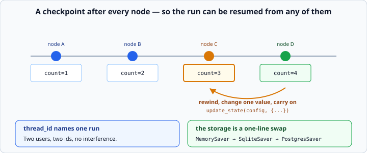

# LangGraph checkpointers and threads

*Week 10 · Day 1 · about 25 minutes*

> By the end of this a graph can be interrupted, restarted, and picked up where it left
> off.

---

## Read the official documentation first

| Page | What it gives you |
|---|---|
| [**Persistence**](https://langchain-ai.github.io/langgraph/concepts/persistence/) | Checkpointers, threads, state history |
| [**How to add persistence**](https://langchain-ai.github.io/langgraph/how-tos/persistence/) | The code |
| [**Time travel**](https://langchain-ai.github.io/langgraph/how-tos/human_in_the_loop/time-travel/) | Rewinding and resuming |
| [**Checkpointer reference**](https://langchain-ai.github.io/langgraph/reference/checkpoints/) | `MemorySaver`, `SqliteSaver`, `PostgresSaver` |

---

## This is the strongest argument for LangGraph you will see all course

It is genuinely hard to build by hand and nearly free here. If you have been sceptical
of the framework since week 8 — and you should have been — this is the day that earns
it.

---

## The problem

Your week 7 agent lived entirely in memory. Restart the process and the run is gone —
the message list, the step count, everything.

For a chat that is fine. For an agent that runs for four minutes across six tool calls,
or one that has to wait for a person, it is not.

Think about what you would have to build:

- somewhere to save state after every step
- a way to name a run so you can find its state again
- a way to resume from saved state rather than starting over
- a way to keep several runs from treading on each other

That is a real subsystem, and it is where hand-rolled agents go to die.

---

## A checkpointer saves state after every node

```python
from langgraph.checkpoint.memory import MemorySaver

app = graph.compile(checkpointer=MemorySaver())
```

**That is the whole change.** Every node's update is now saved as a **checkpoint**, and
the run can be resumed from any of them.



`MemorySaver` keeps them in memory, which survives nothing — it is for learning and for
tests. Real deployments use `SqliteSaver` or `PostgresSaver`, and **the code above is
identical either way**.

Swapping the storage is a one-line change, which is exactly the kind of decision a
framework should make cheap. Compare that with the version where you wrote the
persistence layer yourself and it is welded to your loop.

---

## Threads

```python
config = {"configurable": {"thread_id": "user-42"}}
app.invoke({"count": 0, "log": []}, config)
```

A `thread_id` names **one conversation or one run**. Every checkpoint belongs to a
thread, and threads are independent — two users, two ids, no interference.

The nesting is fiddly and worth memorising: `{"configurable": {"thread_id": ...}}`. It
is a config object with a `configurable` section inside it, and getting it wrong gives
you an unhelpful error.

### Invoking again continues the thread

```python
app.invoke({"count": 0}, config)     # starts
app.invoke({"count": 0}, config)     # does NOT start over
```

**Invoking with the same thread id continues that thread** rather than starting over.
The state you pass in is **merged** into what is already saved — honouring the reducers —
not substituted for it.

That catches people out constantly. With an `operator.add` reducer, passing the same
initial state twice *adds* it twice.

To genuinely start fresh, use a new `thread_id`. Threads are cheap; a UUID per
conversation is normal.

---

## Reading the state back

```python
snapshot = app.get_state(config)
snapshot.values        # the state right now
snapshot.next          # which node would run next — empty when finished
snapshot.config        # includes the checkpoint id
```

**`snapshot.next` is how you tell a finished run from a paused one**, and it is
tomorrow's whole mechanism.

```python
if snapshot.next:
    print(f"Paused before: {snapshot.next}")
else:
    print("Finished")
```

A finished thread has nothing next. A paused one names the node it stopped in front of.

---

## The history

```python
for snapshot in app.get_state_history(config):     # newest first
    print(snapshot.values, snapshot.next)
```

Every checkpoint of the thread. **This is a time machine**: you can look at what the
state was three nodes ago.

And — with the checkpoint id — you can *resume from there*:

```python
history = list(app.get_state_history(config))
earlier = history[3]
app.invoke(None, earlier.config)      # carry on from that point
```

Rewinding a run, changing one value, and continuing is a genuinely powerful debugging
tool. It is the thing your hand-written loop could never do without building a whole
state-saving layer yourself.

It is also how you answer *"what would have happened if the tool had returned something
else?"* without re-running everything from the start — which, on an agent that costs
real money per run, is worth a great deal.

---

## Editing state

```python
app.update_state(config, {"count": 99})
```

Writes a **new checkpoint** with your changes merged in, **honouring the reducers**.

That last part matters. `update_state(config, {"messages": [msg]})` on a state with
`add_messages` *appends* — it does not replace the history. Same rule as a node's return
value, and the same surprise if you expected otherwise.

Used for correcting an agent mid-run, and for tomorrow's "the human said no" case.

You can also attribute the update to a node:

```python
app.update_state(config, {"count": 99}, as_node="increment")
```

which makes the graph resume as though that node had just run — useful when you are
replacing a node's work rather than adjusting state between nodes.

---

## What this makes possible

Four things, and all four are on the critical path for anything real:

**Long-running agents.** A run that takes four minutes survives a deploy.

**Human-in-the-loop.** The graph pauses, the process exits, a person approves tomorrow,
and it continues. That is tomorrow.

**Debugging by time travel.** Rewind, change one thing, replay.

**Multiple concurrent users.** Separate threads, no shared state, no locking. Your week
7 agent had one global `messages` list, and running two conversations through it at once
would have been a mess.

---

## What it costs

Be honest about this too, as you have been all along.

**Storage.** Every node writes a checkpoint. A long agent run produces a lot of them,
and with `PostgresSaver` that is real disk and real rows to clean up.

**Serialisation.** Everything in your state has to be storable. A state holding an open
file handle or a database connection will not checkpoint, and the failure is confusing.
Keep state to plain data — which is a good rule anyway.

**A concept to hold.** Threads, checkpoints, snapshots and configs are four more nouns
between you and a `while` loop.

For a stateless request-response agent, none of this earns its place. **For anything
that pauses, resumes, or runs longer than a request, it is the reason to use the
framework at all.**

---

## Check yourself

```python
config = {"configurable": {"thread_id": "t1"}}
app.invoke({"log": ["a"]}, config)
app.invoke({"log": ["b"]}, config)
```

Assume `log` has an `operator.add` reducer.

1. What is `app.get_state(config).values["log"]`?
2. How would you get a genuinely fresh run?
3. What does `snapshot.next` return on a finished thread?
4. Why can `MemorySaver` not be used in production?

<details>
<summary>Answers</summary>

1. `["a", "b"]` **plus whatever the nodes appended** — the second invoke continued the
   thread and merged the new input rather than replacing it. If you expected `["b"]`,
   this is the trap.
2. Use a different `thread_id`. There is no "reset" — threads are the unit of isolation.
3. An empty tuple, `()`. That is how you distinguish finished from paused.
4. It keeps checkpoints in process memory. A restart loses everything, and a second
   process cannot see the first one's threads — which defeats both of the things
   persistence is for.
</details>

---

## What you can now do

- [ ] Compile a graph with a checkpointer
- [ ] Explain what a checkpoint is and when one is written
- [ ] Use a `thread_id`, with the correct config nesting
- [ ] Say what happens when you invoke the same thread twice
- [ ] Read `snapshot.values` and `snapshot.next`
- [ ] Walk the state history and resume from an earlier checkpoint
- [ ] Use `update_state`, and say why reducers still apply
- [ ] Name four things persistence makes possible, and three costs

**Next:** [Human-in-the-loop with LangGraph](../day-2/human-in-the-loop.md) — a graph
that stops and waits for a person.
