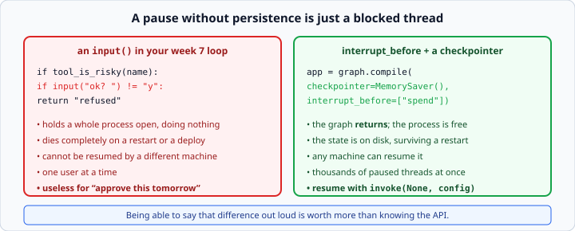

# Human-in-the-loop with LangGraph

*Week 10 · Day 2 · about 25 minutes*

> By the end of this a graph can stop and wait for a person, and a piece of a graph can
> be built and tested on its own.

---

## Read the official documentation first

| Page | What it gives you |
|---|---|
| [**Human-in-the-loop**](https://langchain-ai.github.io/langgraph/concepts/human_in_the_loop/) | The concept and the patterns |
| [**How to add breakpoints**](https://langchain-ai.github.io/langgraph/how-tos/human_in_the_loop/breakpoints/) | `interrupt_before` and `interrupt_after` |
| [**Persistence**](https://langchain-ai.github.io/langgraph/concepts/persistence/) | Yesterday, which today depends on |
| [**Subgraphs**](https://langchain-ai.github.io/langgraph/how-tos/subgraph/) | A graph used as a node |

---

## Yesterday's persistence is what makes today possible

A graph that cannot save its state **cannot pause** — it can only block, which is a
completely different and much worse thing.

---

## Pausing

```python
app = graph.compile(
    checkpointer=MemorySaver(),
    interrupt_before=["spend"],
)
```

The graph runs up to that node, **saves, and returns**. The process is free.

Hours or days later:

```python
app.invoke(None, config)     # None means "carry on from where you were"
```

**Passing `None` rather than a state is the signal to resume.** The state is already
saved; there is nothing to pass.

`interrupt_after` does the same on the other side of a node, for when you want to review
what it produced rather than approve what it is about to do.

| Use | When |
|---|---|
| `interrupt_before` | approve an action before it happens — spending, sending, deleting |
| `interrupt_after` | review what a node produced before it goes further |

---

## Why this needs a checkpointer



Without one there is nothing to come back to. **A pause without persistence is a blocked
thread**: it holds a process open, it does not survive a restart, and it cannot be
resumed by a different machine.

**That distinction is the strongest argument for a framework you will meet.**

Your week 7 loop could have had an `input()` in the middle of the tool dispatch — and it
would have held the process open, died on restart, been unresumable, and served exactly
one user. Being able to say that sentence is worth more than knowing the API.

Consider what "approve this tomorrow morning" actually requires: the process that
started the run is long gone, the approval arrives by email, and a different worker
picks it up. Only saved state can do that.

---

## Finding out where it stopped

```python
snapshot = app.get_state(config)
snapshot.next       # ("spend",) when paused, () when finished
```

`next` is how you tell a paused run from a finished one.

```python
result = app.invoke(initial_state, config)
snapshot = app.get_state(config)

if snapshot.next:
    pending = snapshot.values["pending_action"]
    print(f"Waiting for approval: {pending}")
else:
    print(f"Done: {result}")
```

**Show the person what they are approving.** A prompt saying "approve? y/n" with no
context gets a reflexive yes, which makes the whole mechanism theatre. Put the pending
action in the state so the interface can display it.

---

## Saying no

Resuming runs the node. To **refuse**, change the state first and let the node see it:

```python
app.update_state(config, {"approved": False})
app.invoke(None, config)        # the node runs, sees the refusal, and does nothing
```

```python
def spend(state: State) -> dict:
    if not state.get("approved"):
        return {"log": ["spend refused by human"], "spent": 0}
    return {"log": [f"spent {state['amount']}"], "spent": state["amount"]}
```

**The node has to be written to check.** That is a design decision worth noticing: the
graph gives you the pause, and **what "no" means is yours to define.**

That is the same shape as week 8's lesson about `ToolNode` — LangGraph manages *flow*,
not *policy*. It will stop the graph for you; deciding what a refusal does is your job,
and it should be, because it is domain logic.

### Three things a human can do at a pause

| Action | How |
|---|---|
| **Approve** | `invoke(None, config)` |
| **Reject** | `update_state(config, {"approved": False})` then resume |
| **Edit** | `update_state(config, {"amount": 50})` then resume |

That third one is underrated. A human who can say *"yes, but £50 not £500"* is far more
useful than one who can only say yes or no — and it costs you nothing extra, because
`update_state` already merges arbitrary changes.

---

## Where to put the interrupt

Not everywhere. An agent that asks permission for every step is worse than one that asks
for none, because people stop reading.

Interrupt before anything **irreversible or expensive**:

- spending money
- sending a message on someone's behalf
- deleting or overwriting data
- anything that leaves your system

That list should look familiar — it is the same judgement about consequences that
governs which tools you give an agent at all. **The interrupt is a second line of
defence, not a substitute for narrow tools.**

---

## Subgraphs

A compiled graph can be a node in another graph:

```python
parent.add_node("child", child_graph)
```

Worth doing when a piece of the process is **reused**, or is **complicated enough to want
its own tests**. Not worth doing to make a diagram look tidier.

The real benefit is testing: a subgraph is a compiled graph, so you can invoke it on its
own with its own state and assert on the result — exactly as you tested a single node in
week 8, one level up.

### The gotcha, and it is a good one

**A subgraph returns its whole state, not just what its nodes changed.**

So a key with an accumulating reducer that the child merely *received* gets added to the
parent's copy all over again — and you get it twice, whatever the child's nodes returned.

```python
# parent state:  log = ["a"]
# child receives log = ["a"], its nodes add nothing
# child returns whole state, including log = ["a"]
# parent's reducer adds it:  log = ["a", "a"]
```

**The fix is to give the child its own state schema containing only the keys it actually
needs.** Then there is nothing to double.

It is a genuinely confusing hour if you meet it by accident, and it is exactly the kind
of thing that makes people distrust a framework. Knowing it exists turns an hour into a
minute.

---

## Testing a paused graph

```python
def test_pauses_before_spending(app):
    config = {"configurable": {"thread_id": "test-1"}}
    app.invoke({"amount": 500, "log": []}, config)

    snapshot = app.get_state(config)
    assert snapshot.next == ("spend",)
    assert snapshot.values["spent"] == 0        # nothing happened yet


def test_refusal_spends_nothing(app):
    config = {"configurable": {"thread_id": "test-2"}}
    app.invoke({"amount": 500, "log": []}, config)
    app.update_state(config, {"approved": False})
    app.invoke(None, config)

    assert app.get_state(config).values["spent"] == 0
```

A fresh `thread_id` per test, which is week 4's fixture-freshness lesson in a new place —
threads are exactly the shared mutable state that makes tests order-dependent.

`MemorySaver` is perfect here: no files, no cleanup, and it disappears with the process.

---

## Check yourself

1. Why does `interrupt_before` need a checkpointer?
2. What does `app.invoke(None, config)` do?
3. You resume without setting `approved`. What happens?
4. Your subgraph's log entries appear twice. Why?

<details>
<summary>Answers</summary>

1. Because the graph **returns** at the interrupt. Without saved state there is nothing
   to resume from — the run is simply lost. The alternative, blocking, holds the process
   and dies on restart.
2. Resumes the thread from its saved state. `None` is the signal "there is no new input;
   carry on".
3. **The node runs and does whatever it does by default.** If `spend` only checks
   `state.get("approved")` and nothing set it, that is falsy and it refuses — but if your
   node defaulted to approving, resuming would spend the money. **Default to refusing.**
4. The subgraph returned its **whole state**, including the log it merely received, and
   the parent's reducer added it again. Give the child a narrower state schema.
</details>

---

## What you can now do

- [ ] Compile a graph with `interrupt_before` and a checkpointer
- [ ] Explain the difference between pausing and blocking
- [ ] Detect a paused run with `snapshot.next`, and show what is pending
- [ ] Resume with `invoke(None, config)`
- [ ] Implement approve, reject and edit at a pause
- [ ] Say why "what no means" is your job and not the framework's
- [ ] Choose where an interrupt belongs
- [ ] Use a subgraph, and diagnose the doubled-state gotcha
- [ ] Test a paused graph with a fresh thread per test

**Next:** [CrewAI basics](../day-3/crewai-basics.md) — a completely different way to
arrange the same pieces.
