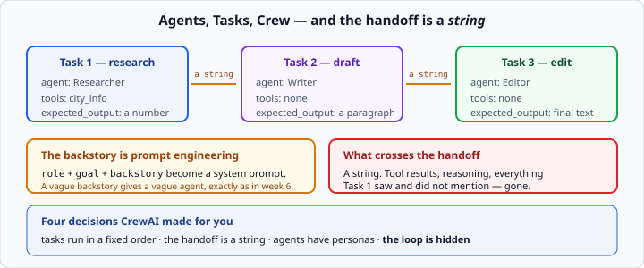

# CrewAI basics

*Week 10 · Day 3 · about 30 minutes*

> By the end of this you can build a crew, and say what CrewAI decided for you.

---

## Read the official documentation first

| Page | What it gives you |
|---|---|
| [**CrewAI — Introduction**](https://docs.crewai.com/introduction) | What it is for |
| [**Agents**](https://docs.crewai.com/concepts/agents) | `role`, `goal`, `backstory` |
| [**Tasks**](https://docs.crewai.com/concepts/tasks) | `description`, `expected_output` |
| [**Crews**](https://docs.crewai.com/concepts/crews) | `Process.sequential` |
| [**Building effective agents**](https://www.anthropic.com/engineering/building-effective-agents) | Read the "workflows vs agents" section again with CrewAI in mind |

---

## A note on running it

Building a crew needs no key. **Running one calls a real model and costs real money**, so
the course's tests only check that your crew is wired correctly — the roles, the tools,
the tasks, the order.

That is not a compromise. It is most of what there is to get right, and it is the same
distinction as every other week: **the structure is yours, the model's answer is not.**

If you have a key, run it for real once at the end. Watch the agents talk to each other.
Then count how many model calls it took to answer something your week 7 agent answered
in two.

---

## The model: agents, tasks, crews

```python
from crewai import Agent, Task, Crew, Process

researcher = Agent(
    role="Researcher",
    goal="Find accurate facts about cities",
    backstory="You check things rather than remembering them.",
    tools=[city_info],
)

find = Task(
    description="Find the population of Lisbon.",
    expected_output="A single number",
    agent=researcher,
)

crew = Crew(agents=[researcher], tasks=[find], process=Process.sequential)
result = crew.kickoff()
```



Three ideas:

- an **Agent** is a role, a goal, a backstory, and some tools
- a **Task** is a description, an expected output, and an agent to do it
- a **Crew** is agents plus tasks plus a process

`Process.sequential` runs the tasks in order, feeding each result to the next.

Notice what is **not** here: no loop, no `stop_reason`, no message list, no state schema.
That is the pitch, and it is a real one — this is the least code you have written for an
agent since week 6.

---

## The prompt is now a persona

`role`, `goal` and `backstory` are assembled into a system prompt for you.

So the backstory is not colour — **it is prompt engineering with a friendlier name**, and
a vague one produces a vague agent exactly as a vague system prompt did in week 6.

| Weak | Strong |
|---|---|
| "You are a helpful researcher." | "You check things rather than remembering them. You always use a tool when one exists, and say 'not found' rather than guessing." |

**Everything you learned about system prompts applies unchanged.** Say what to do and
what not to do. Be specific about the shape, not the vibe. Only the field names changed.

This is worth being slightly wary of. A persona API makes it feel like you are casting a
play rather than writing a prompt, and people write backstories they would never accept
as a system prompt. Read yours back as a system prompt and judge it that way.

---

## `expected_output` is the output contract

Week 6's *"return only a JSON object with these keys"*, wearing a different name.

It is worth as much attention here as it was there, and for the same reason: **it is what
the next task receives.** A vague `expected_output` on task 1 means task 2 gets something
it has to interpret.

| Weak | Strong |
|---|---|
| "The population" | "A single integer with no commas, units or explanation" |
| "A summary" | "Three bullet points, each under 20 words, no preamble" |

---

## What CrewAI decided for you

**This is the day's real content.** The abstraction is opinionated, and the opinions are:

| Decision | What it assumes |
|---|---|
| Tasks run in a fixed order | your work is a **pipeline**, not a loop |
| Each task's output feeds the next | the handoff is a **string** |
| Agents have personas | the model works better when told who it is |
| The loop is hidden | you will not need to see it |

**Every one of those is reasonable and none is free.**

### "Your work is a pipeline"

The biggest assumption. `Process.sequential` cannot go back. If task 3 discovers that
task 1 fetched the wrong city, there is no route to a retry — the pipeline runs forwards.

Your week 7 loop could go round again. A LangGraph conditional edge could route back.
CrewAI's sequential process cannot.

If your work genuinely is a pipeline, that constraint is a *feature* — it is why the code
is so short. If it is not, you have chosen the wrong shape.

### "The handoff is a string"

Everything task 1 saw — the tool results, the intermediate reasoning, the thing it
decided was irrelevant — is gone. What crosses is what it wrote down.

Tomorrow's article calls this **context loss at the handoff**, and it is where
multi-agent systems actually fail in practice. It is much harder to see than a crash.

### "The loop is hidden"

The one to think about hardest.

Your week 7 agent showed you every step. Here you get a result. When something goes
wrong you have `verbose=True` and a lot of scrolling — and no per-step structure you can
assert on.

Compare that with LangGraph's `stream`, which hands you a typed update per node. **Both
frameworks hide the loop; only one gives it back to you as data.** That is a real
difference and a good thing to say on Friday.

---

## Where it is genuinely good

A **linear pipeline of clearly different jobs** — research, then draft, then edit — where
each step has a different persona and the handoff really is just text.

That describes a lot of content work, and for it CrewAI is genuinely the shortest path
from idea to running system. The persona model, which feels like decoration on a
single-agent task, does real work when three agents need genuinely different
instructions.

### Where it is not

- **anything that loops** — a pipeline cannot go back
- **anything needing a pause and resume** — no checkpointer, no thread
- **anything where you must inspect each step** — you get scrollback, not data
- **anything cost-sensitive** — three agents is at minimum three model calls

---

## Comparing it honestly

You now have three ways to build the same thing. Fill this in with your own numbers:

| | week 7 loop | LangGraph | CrewAI |
|---|---|---|---|
| lines to a working agent | | | |
| can it loop? | yes | yes | not sequentially |
| can it pause and resume? | no | yes | no |
| per-step data | you built it | `stream` | `verbose=True` scrollback |
| model calls for the same task | | | |
| what you must understand first | everything | state and reducers | roles and tasks |

**The last row is the interesting one.** CrewAI has the lowest floor — you can get
something running knowing least. That is genuinely valuable, and it is also exactly why
this course fenced it until week 10: a floor that low means you can build something that
works without understanding any of it, and then you cannot fix it.

---

## Check yourself

1. Where does an agent's system prompt come from?
2. Task 3 discovers task 1 fetched the wrong city. What does `Process.sequential` do?
3. What does task 2 receive from task 1?
4. Your crew gives a wrong answer. How do you find out which task went wrong?

<details>
<summary>Answers</summary>

1. Assembled from `role`, `goal` and `backstory`. Which means every week 6 prompting
   lesson applies — read your backstory back as a system prompt and judge it as one.
2. **Nothing.** The pipeline runs forwards. There is no route back to task 1, so the
   wrong city flows through to the end. Your week 7 loop and a LangGraph conditional edge
   could both go back; this cannot.
3. **A string** — whatever task 1 produced as its output. Not its tool results, not its
   reasoning, not anything it saw and chose not to mention.
4. `verbose=True` and read the scrollback. There is no structured per-step record like
   LangGraph's `stream` or your own week 7 trace — which is the clearest cost of hiding
   the loop.
</details>

---

## What you can now do

- [ ] Build an `Agent`, a `Task` and a `Crew` with `Process.sequential`
- [ ] Write a backstory and judge it as a system prompt
- [ ] Write an `expected_output` that is a real contract for the next task
- [ ] Name the four decisions CrewAI made for you
- [ ] Explain why a sequential pipeline cannot retry
- [ ] Say what is lost at a string handoff
- [ ] Say where CrewAI is the right tool and where it is not
- [ ] Compare all three approaches with your own numbers

**Next:** [Multi-agent design trade-offs](../day-4/multi-agent-tradeoffs.md) — deciding
whether you need more than one agent at all.
