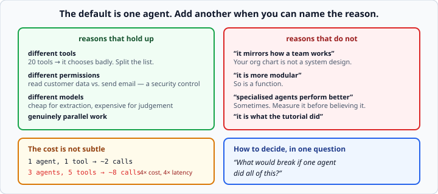

# Multi-agent design trade-offs

*Week 10 · Day 4 · about 20 minutes*

> By the end of this you can decide whether a problem needs more than one agent, and
> defend the answer either way.

---

## Read the official documentation first

| Page | What it gives you |
|---|---|
| [**Building effective agents**](https://www.anthropic.com/engineering/building-effective-agents) | **The key reading.** Workflows versus agents, and when to add complexity |
| [**Multi-agent systems**](https://langchain-ai.github.io/langgraph/concepts/multi_agent/) | LangGraph's patterns and their trade-offs |
| [**CrewAI — Crews**](https://docs.crewai.com/concepts/crews) | The sequential process |

> Read the Anthropic post properly if you skipped it in week 7. Its central argument —
> **use the simplest thing that works, and add complexity only when it demonstrably
> buys something** — is the whole of today.

---

## The default is one agent

One agent with five tools handles most things people build crews for. It is cheaper, it
is easier to debug, and there is nowhere for context to get lost between steps.

**Start there. Add an agent when you can name the reason.**



---

## The reasons that hold up

| Reason | Why it is real |
|---|---|
| **Different tools** | An agent with twenty tools chooses badly. Splitting the tool list splits the decision. |
| **Different permissions** | One agent may read customer data, another may send email. That boundary is a **security control**, not a design preference. |
| **Different models** | A cheap model for extraction, an expensive one for judgement. Real money. |
| **Genuinely parallel work** | Six independent lookups can run at once. |

**"Different permissions" is the strongest of the four**, and the one most people never
think of.

An agent that can both read your customer database and send email is one prompt
injection away from exfiltrating the database by email. Two agents, with a human or a
narrow interface between them, is a genuine architectural boundary — not a stylistic
choice.

That is a very good thing to be able to say in an interview, and it is the kind of
reasoning that separates someone who has used agent frameworks from someone who has
thought about them.

**"Different tools" is the most common legitimate reason.** Tool choice degrades as the
list grows; twenty tool descriptions in one prompt is twenty chances to pick the wrong
one. Splitting them means each agent chooses from five.

---

## The reasons that do not

| Reason | Why not |
|---|---|
| "It mirrors how a team works" | Your org chart is not a system design. |
| "It is more modular" | So is a function. |
| "Specialised agents perform better" | Sometimes. **Measure it** before believing it. |
| "It is what the tutorial did" | The tutorial was demonstrating the tool. |

The first is the seductive one. "Researcher, writer, editor" is a satisfying story and it
maps onto how humans divide work — but humans divide work because of **communication
bandwidth and attention limits**, and a model has neither in the same way.

A single agent can read the sources and write the draft without a handoff, and the
handoff is where things get lost.

---

## The cost is not subtle

Every extra agent is **at least one more model call**, plus the tokens to hand context
across.

A three-agent crew answering something a single agent handles in two calls might take
eight. **That is four times the cost and four times the latency for the same answer.**

You can estimate this before writing any code:

```python
def estimate_calls(agent_count: int, tools_used: int) -> int:
    """Rough model-call count: one per agent to decide, one per tool result to react to."""
    return agent_count + tools_used
```

Crude, and enough to notice a four-times difference before writing anything.

```python
designs = {
    "single agent, 5 tools": estimate_calls(1, 5),      # 6
    "three agents, 5 tools": estimate_calls(3, 5),      # 8
}
```

Then measure the real thing and compare. `response.usage` gives you the tokens, week 6
gave you the cost function, and week 9 gave you the habit of putting a number on it.

**"We compared them and the multi-agent version cost 3.2× more for the same answer
quality" is a complete answer.** So is "it cost more and was worth it, because the
permission boundary was a requirement."

---

## Context loss at the handoff

The sharpest technical objection, and the one that is hardest to see.

When agent A finishes and passes to agent B, **what crosses is a string**. Everything A
saw — the tool results, the intermediate reasoning, the thing it decided was irrelevant —
is gone.

If B needs any of that, it must re-fetch it, or A must have thought to include it.

**This is where multi-agent systems actually fail in practice**, and it fails quietly:

- no exception
- no missing field
- just an answer that is subtly less good than it should have been

You only notice by comparing against a single-agent version — which is exactly what your
milestone this week asks you to do, and why.

### It is worse than it looks

A wants to be a good citizen, so it summarises. Summarising is lossy, and A does not know
what B will need. So A guesses, and A's guess is a prompt-engineering problem you now
have in *addition* to the two agents' own prompts.

Three prompts to get right instead of one, and the third is the least visible.

---

## How to decide, in one question

> ***"What would break if one agent did all of this?"***

If the answer is **"nothing, it would just be a longer tool list"** — use one agent.

If it is **"it would need permissions it should not have"**, or **"it would be choosing
between twenty tools"**, you have your reason and you can say it out loud.

That question is the whole of today. It works because it forces you to name a *failure*
rather than a *preference*, and preferences are what produce eight-call systems that
answer in two.

---

## Writing the judgement down

```python
REASONS = [
    "different_tools",
    "different_permissions",
    "different_models",
    "parallel_subtasks",
]


def assess(requirements: dict) -> dict:
    """Recommend one agent or several, and say why."""
    reasons = [name for name in REASONS if requirements.get(name)]
    return {
        "recommend": "multi" if reasons else "single",
        "reasons": reasons,
    }
```

**Any one flag justifies more than one agent; none of them means one.** Note the default
is `"single"` — the burden of proof is on complexity, which is the whole point.

Encoding a judgement as a function is a genuinely useful move. It makes the criteria
explicit, it makes them reviewable, and it stops the decision being made by whoever read
a blog post most recently.

---

## Patterns worth knowing by name

If you do need several agents, these are the shapes:

| Pattern | Shape | Good for |
|---|---|---|
| **Pipeline** | A → B → C, fixed order | clearly sequential work — CrewAI's default |
| **Supervisor** | one agent routes to specialists | different tools per specialist |
| **Parallel + join** | several run at once, results merged | independent subtasks |
| **Hierarchical** | agents that spawn agents | rarely. Cost and debugging both explode |

**Supervisor is the one that most often earns its place**, because it directly addresses
the "twenty tools" problem: the supervisor chooses a *specialist*, and the specialist
chooses from a short list.

In LangGraph, all four are just graphs — nodes and conditional edges, which you already
know how to build. That is worth noticing: **you do not need a multi-agent framework to
build a multi-agent system.**

---

## What to write on Friday

The milestone is the same task two ways, plus a recommendation. Make it specific:

- **model calls** for each, measured not guessed
- **cost** for each, from `usage`
- **wall-clock time** for each
- **answer quality** on a small golden set — week 9's method, applied here
- **the recommendation, with the reason**, in one sentence

And be willing to conclude that the single agent won. **That is the most likely honest
result**, and reporting it is worth more than manufacturing a case for the more
impressive-sounding design.

An engineer who says "I built both and the simple one was better, here are the numbers"
is one you can trust with an architecture decision.

---

## Check yourself

For each, say one agent or several, and why.

1. Summarise a document, then translate the summary.
2. Read from a customer database and send emails.
3. Answer questions using six lookup tools.
4. Research a topic across ten independent sources, then write a report.

<details>
<summary>Answers</summary>

1. **One.** Two steps, same tools, no permission boundary. A single agent does both in
   one call each and nothing is handed off. "It mirrors how a team works" is the only
   argument for splitting it, and that is not a reason.
2. **Several** — and this is the strongest case there is. The permission boundary is a
   security control: one agent with both capabilities can be induced to exfiltrate the
   database by email.
3. **One.** Six tools is well within what a single agent chooses between reliably. Ask
   again at twenty.
4. **Several, arguably.** The ten lookups are genuinely parallel, which is a real reason
   — though note that a single agent making ten parallel tool calls (week 7 Thursday)
   gets the same concurrency without any handoff. **Parallel work justifies concurrency;
   it does not automatically justify separate agents.** Worth arguing both ways.
</details>

---

## What you can now do

- [ ] Default to one agent and put the burden of proof on complexity
- [ ] Name the four reasons that justify several, and why permissions is strongest
- [ ] Reject the four that do not
- [ ] Estimate model calls before writing code
- [ ] Explain context loss at the handoff and why it fails quietly
- [ ] Decide with "what would break if one agent did all of this?"
- [ ] Name the four multi-agent patterns and when each fits
- [ ] Report an honest comparison, including when the simple design won

**Next:** the week 10 milestone — the same task two ways, plus a recommendation. Then
week 11: **Project 3**, deployed, traced and evaluated.
