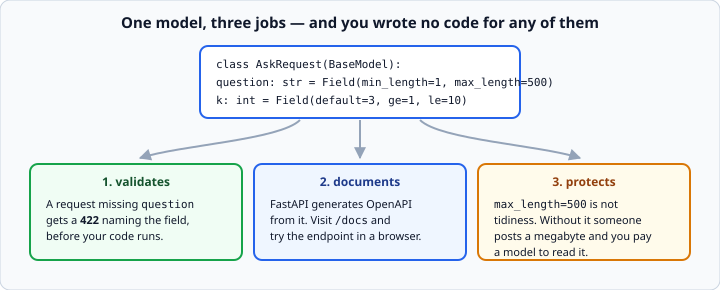

# FastAPI basics

*Week 11 · Day 1 · about 30 minutes*

> By the end of this your agent answers HTTP requests instead of terminal input.

---

## Read the official documentation first

| Page | What it gives you |
|---|---|
| [**FastAPI — First Steps**](https://fastapi.tiangolo.com/tutorial/first-steps/) | The smallest service |
| [**Request Body**](https://fastapi.tiangolo.com/tutorial/body/) | Pydantic models as requests |
| [**Response Model**](https://fastapi.tiangolo.com/tutorial/response-model/) | Declaring what comes back |
| [**Handling Errors**](https://fastapi.tiangolo.com/tutorial/handling-errors/) | `HTTPException` |
| [**Dependencies**](https://fastapi.tiangolo.com/tutorial/dependencies/) | `Depends` |
| [**Testing**](https://fastapi.tiangolo.com/tutorial/testing/) | `TestClient` |

---

## Week 5, from the other side

In week 5 you *called* an HTTP API and read status codes. This week you *are* the API and
you choose them.

Everything you learned about being a good client tells you how to be a good server: pass
timeouts, return honest status codes, do not make people guess your shape.

---

## The smallest service

```python
from fastapi import FastAPI

app = FastAPI()

@app.get("/health")
def health():
    return {"status": "ok"}
```

```bash
uvicorn app:app --reload
```

`app:app` means *the object called `app` in the module called `app`*. Then
`http://127.0.0.1:8000/health` in a browser — and `/docs` for interactive documentation
FastAPI generated from your code.

**Open `/docs` now.** It is the single most persuasive thing about FastAPI, and it comes
from the type hints you were writing in week 4 for reasons that seemed abstract at the
time.

---

## Requests are Pydantic models

```python
from pydantic import BaseModel, Field

class AskRequest(BaseModel):
    question: str = Field(min_length=1, max_length=500)
    k: int = Field(default=3, ge=1, le=10)

@app.post("/ask")
def ask(request: AskRequest):
    return {"answer": answer_question(request.question, request.k)}
```



Week 5's models, now doing **three jobs at once**:

1. **They validate the request.** A request missing `question` gets a **422** with a
   message naming the field, and you wrote no code for that.
2. **They document the endpoint.** `/docs` shows the shape and lets people try it.
3. **They reject bad input before your code runs.**

That third one is a security property. `max_length=500` is not tidiness — **without it
somebody posts a megabyte and you pay a model to read it.** `ge=1, le=10` on `k` stops
someone requesting ten thousand chunks.

**Put a bound on every field that reaches a paid API.** Anything unbounded that arrives
from outside is a bill somebody else can run up.

---

## Responses are models too

```python
class AskResponse(BaseModel):
    answer: str
    sources: list[str]
    refused: bool

@app.post("/ask", response_model=AskResponse)
def ask(request: AskRequest) -> AskResponse:
    ...
```

Declaring the response means:

- it is **documented**
- a field you forget to fill is an **error**, not a missing key somebody discovers in
  production
- fields you did not declare are **stripped**, which is a real safety net — an internal
  debug field cannot leak into a public response by accident

That last point matters more than it sounds. `response_model` is the difference between
"we return whatever the dict happened to contain" and "we return exactly this".

---

## Status codes, deliberately

```python
from fastapi import HTTPException

if not results:
    raise HTTPException(status_code=404, detail="No documents matched")
```

Week 5 in reverse: then you read status codes, now you choose them. The same table
applies — **4xx is the caller's problem, 5xx is yours** — and choosing correctly is what
lets a caller write sensible error handling.

| Situation | Code |
|---|---|
| worked | 200 |
| created something | 201 |
| the request was malformed | 400 |
| failed validation | 422 *(FastAPI does this for you)* |
| no API key, or wrong one | 401 |
| nothing matched | 404 |
| too many requests | 429 |
| your code broke | 500 |
| a dependency is down | 503 |

**Do not return 200 with `{"error": ...}` in the body.** Every client then has to parse
your body to know whether it worked, and none of them will. Week 5's whole lesson about
checking status codes only works if servers use them honestly.

### Never leak internals

```python
except Exception as error:
    logger.exception("ask failed")                      # full detail in the log
    raise HTTPException(status_code=500, detail="Internal error")   # nothing to the caller
```

A traceback in an HTTP response tells an attacker your file paths, your library versions
and your structure. Log the detail; return the code.

---

## Dependency injection, again

```python
from fastapi import Depends

def get_agent():
    return AGENT

@app.post("/ask")
def ask(request: AskRequest, agent = Depends(get_agent)):
    ...
```

**Week 6's rule, arriving as a framework feature.**

You have been passing `client` into every function since week 6 so the tests could hand
you a fake. `Depends` is that idea, wired into the routing — and it means a test can
override the dependency wholesale:

```python
app.dependency_overrides[get_agent] = lambda: FakeAgent()
```

Now the whole service runs against a fake model, in a test, in milliseconds, for free.

That is not a small thing. **A web service that can only be tested against a live paid
API is a service nobody will test.**

---

## Testing

```python
from fastapi.testclient import TestClient

client = TestClient(app)

def test_health():
    response = client.get("/health")
    assert response.status_code == 200
    assert response.json()["status"] == "ok"


def test_ask_rejects_empty_question():
    response = client.post("/ask", json={"question": ""})
    assert response.status_code == 422
```

No server running, no port, no network. `TestClient` calls the app directly.

Week 4's pytest, week 5's status codes, week 6's dependency injection — all three
arriving at once, on a real web service. **Test the failure paths**: empty question, `k`
out of range, a missing field. Those are the requests you will actually receive.

---

## Streaming

```python
from fastapi.responses import StreamingResponse

@app.post("/ask/stream")
def ask_stream(request: AskRequest):
    def generate():
        for chunk in agent.stream(request.question):
            yield chunk
    return StreamingResponse(generate(), media_type="text/plain")
```

Week 6's streaming, now reaching a browser. The user sees text appear rather than waiting
eight seconds for a response.

Note the function `yield`s. A generator is how you produce a stream — and it is one of
the few places in this course where `yield` is the natural answer.

---

## `async` matters here

```python
@app.post("/ask")
async def ask(request: AskRequest):
    response = await async_client.messages.create(...)
```

**A synchronous endpoint that waits eight seconds for a model blocks a worker for eight
seconds.** With four workers, five simultaneous users means the fifth waits.

This is week 7's async lesson with a consequence attached. FastAPI runs `def` endpoints
in a thread pool so they do not block the event loop, which is a decent safety net — but
for anything that waits on a network, `async def` with an async client is the right
answer.

Do not mix them: an `async def` endpoint that calls a **blocking** client is the worst of
both, because it blocks the event loop itself. Either `async def` with `await`, or plain
`def` and let FastAPI use its thread pool.

---

## Check yourself

1. What status code does a request missing a required field get, and who wrote that code?
2. Why put `max_length` on a question field?
3. Your endpoint raises `KeyError`. What should the caller see?
4. Why does `Depends` matter for testing?

<details>
<summary>Answers</summary>

1. **422**, and **nobody** — FastAPI generates it from the Pydantic model, with a body
   naming the field and the rule.
2. It is a cost and abuse control. An unbounded field that reaches a paid API is a bill
   anyone on the internet can run up.
3. A **500** with a generic message. The traceback goes to your logs; leaking it to the
   caller exposes your file paths and library versions.
4. Because `dependency_overrides` lets a test swap the real agent for a fake without
   touching the endpoint. Otherwise every test needs a live, paid model call — and so
   there are no tests.
</details>

---

## What you can now do

- [ ] Write a FastAPI service and run it with uvicorn
- [ ] Use Pydantic request models, and name the three jobs they do
- [ ] Bound every field that reaches a paid API
- [ ] Declare a `response_model` and say what it protects against
- [ ] Choose status codes deliberately, and never return 200 with an error body
- [ ] Log the detail and return a generic 500
- [ ] Use `Depends`, and override it in tests
- [ ] Test with `TestClient`, including the failure paths
- [ ] Say why `async def` matters for a model-backed endpoint

**Next:** [Twelve-factor config and deployment](../day-2/config-and-deployment.md) —
making it run somewhere other than your laptop.
