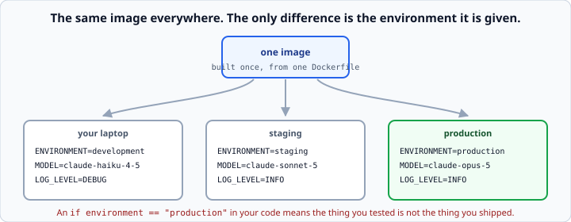

# Twelve-factor config and deployment

*Week 11 · Day 2 · about 25 minutes*

> By the end of this your service can be configured from outside, says whether it is
> healthy, and has everything a platform needs to run it.

---

## Read the official documentation first

| Page | What it gives you |
|---|---|
| [**The Twelve-Factor App — Config**](https://12factor.net/config) | The rule, in three paragraphs |
| [**Twelve-Factor — Logs**](https://12factor.net/logs) | Why logs go to stdout |
| [**FastAPI in Containers**](https://fastapi.tiangolo.com/deployment/docker/) | The official Docker guidance |
| [**`os.environ`**](https://docs.python.org/3.14/library/os.html#os.environ) | Week 5, now load-bearing |
| [**Dockerfile reference**](https://docs.docker.com/reference/dockerfile/) | `FROM`, `COPY`, `RUN`, `CMD` |

---

## Configuration comes from the environment

Week 5's rule, now load-bearing. **The same image runs in development and production,
and the only difference is the environment it is given.**



```python
class Settings(BaseModel):
    api_key: str
    model: str = "claude-opus-5"
    environment: str = "development"
    max_question_length: int = 500
    log_level: str = "INFO"


def load_settings() -> Settings:
    """Build settings from the environment, failing loudly if anything required is missing."""
    api_key = os.getenv("ANTHROPIC_API_KEY")
    if not api_key:
        raise RuntimeError(
            "ANTHROPIC_API_KEY is not set. Copy .env.example to .env and fill it in."
        )
    return Settings(
        api_key=api_key,
        model=os.getenv("MODEL", "claude-opus-5"),
        environment=os.getenv("ENVIRONMENT", "development"),
        max_question_length=int(os.getenv("MAX_QUESTION_LENGTH", "500")),
    )
```

**Validate it at startup, not at first use.** A service that starts happily and fails on
the first real request has wasted a deploy and a rollback — and it will fail at whatever
hour your first user arrives.

Fail loudly and **say what to set**. Week 3's error-message rule, at the point where it
costs the most to get wrong.

### The rule that follows from it

**No `if environment == "production"` in your code.**

The moment that appears, the thing you tested is not the thing you shipped, and the
production-only branch is the one nobody has ever run. Put the difference in a *value* —
a model name, a log level, a timeout — not in a branch.

---

## Never log a secret

```python
def mask(value: str) -> str:
    """Return a value safe to log: last four characters only."""
    return f"...{value[-4:]}" if value else "(unset)"


def redacted(settings: Settings) -> dict:
    return {**settings.model_dump(), "api_key": mask(settings.api_key)}
```

Logging the config at startup is genuinely useful — **it is how you find out that
production is pointing at the wrong model**, which is a real and common failure.

Logging your key alongside it puts the key in every log aggregator you use, forever, read
by everyone with log access.

**Redact once, in one place, and use that function everywhere.** A masking function used
in three places and forgotten in the fourth is how keys leak.

---

## Health checks

```python
@app.get("/health")
def health():
    return {"status": "ok", "version": VERSION, "uptime_seconds": uptime()}
```

A platform calls this **every few seconds** to decide whether to send you traffic. So:

**It must be cheap.** No model calls, no database queries. A health check that costs
money is a health check that bankrupts you at 3am — and this is not a joke; it has
happened to real teams.

**It must be honest.** If a dependency you need is missing, say so and return a 503. A
service that reports healthy while broken is worse than one that reports nothing,
because the platform keeps sending it traffic.

### Two endpoints

```python
@app.get("/health")
def health():
    """Am I running? Cheap, always true if the process is up."""
    return {"status": "ok", "version": VERSION}


@app.get("/ready")
def ready(response: Response):
    """Can I actually serve? Checks dependencies."""
    problems = []
    if not settings.api_key:
        problems.append("no api key")
    if not store.chunks:
        problems.append("index empty")

    if problems:
        response.status_code = 503
        return {"status": "not ready", "problems": problems}
    return {"status": "ready"}
```

`/health` is *liveness* — restart me if this fails. `/ready` is *readiness* — stop
sending me traffic if this fails.

They mean different things to a platform, and conflating them means either restarting a
service that was only briefly busy, or sending traffic to one that cannot serve it.

---

## The start command

```
uvicorn app:app --host 0.0.0.0 --port $PORT
```

**`0.0.0.0` rather than `127.0.0.1`.** In a container the request arrives from outside
it, and `127.0.0.1` only accepts connections from inside.

**This is the single most common reason a deploy "works locally" and returns nothing in
production**, and the symptom is maddening: the container is running, the logs look fine,
and every request times out.

**`$PORT` from the environment**, because the platform chooses it. Hard-coding 8000 works
until the platform gives you 10000.

---

## A Dockerfile

```dockerfile
FROM python:3.12-slim

WORKDIR /app

COPY requirements.txt .
RUN pip install --no-cache-dir -r requirements.txt

COPY . .

EXPOSE 8000
CMD ["sh", "-c", "uvicorn app:app --host 0.0.0.0 --port ${PORT:-8000}"]
```

**Copy `requirements.txt` before the rest and install from it.**

Docker caches each step. Change a line of code and only the steps *after* the change
re-run — so with this ordering, a code change does not reinstall every dependency. It
turns a two-minute build into a five-second one, and **it is the single most useful
Docker fact.**

Reverse the two `COPY` lines and every build reinstalls everything. That is the whole
difference.

Other things earning their place:

- **`-slim`** — a much smaller image than the full one, which means faster pulls
- **`--no-cache-dir`** — pip's cache is dead weight inside an image
- **`${PORT:-8000}`** — the platform's port, or 8000 locally

### `.dockerignore`

```
.venv/
__pycache__/
.git/
.env
*.pyc
```

Without it, `COPY . .` copies your virtual environment and your git history into the
image — hundreds of megabytes, slower builds, and **your `.env` file with your key in
it**.

That last one is the important one. A `.env` inside a shipped image is a leaked secret,
and the file you carefully gitignored goes in anyway.

---

## Logs go to stdout

```python
import logging, sys

logging.basicConfig(stream=sys.stdout, level=settings.log_level)
```

**Do not write log files.** In a container, the filesystem disappears when the container
does, and nobody is going to `docker exec` in to read them.

Write to stdout and let the platform collect them. That is
[twelve-factor logs](https://12factor.net/logs), and it is why tomorrow's structured
logging is `print`-shaped rather than file-shaped.

---

## A deployment checklist

Before you call it deployed:

- [ ] `/health` responds, and does not call a model
- [ ] `/ready` returns 503 when a dependency is missing
- [ ] every secret comes from the environment, and none is logged
- [ ] `.env` is gitignored **and** dockerignored
- [ ] `.env.example` exists and lists every variable
- [ ] the start command binds `0.0.0.0` and reads `$PORT`
- [ ] the image builds from a clean clone
- [ ] the README's run instructions work from that clean clone
- [ ] logs go to stdout
- [ ] you have actually called the deployed URL from outside your network

That last one catches more than you would think.

---

## Check yourself

1. Your service works locally and returns nothing when deployed. First thing to check?
2. Why must `/health` not call the model?
3. What breaks if you `COPY . .` before installing requirements?
4. Your `.env` ends up inside the Docker image. What did you forget, and what is the
   consequence?

<details>
<summary>Answers</summary>

1. **The bind address.** `127.0.0.1` only accepts connections from inside the container.
   Use `0.0.0.0`.
2. It is called every few seconds by the platform. A model call per check is continuous
   spend for no value, and it makes your health check depend on a third party — so a slow
   API makes the platform think your service is dead and restart it.
3. Every build reinstalls every dependency, because the cached layer is invalidated by
   any code change. Two minutes instead of five seconds, on every single build.
4. **`.dockerignore`.** The consequence is a leaked secret: your key is now inside an
   image that may be pushed to a registry, pulled by others, and cached in layers you
   cannot easily delete. Rotate the key first, then fix the file.
</details>

---

## What you can now do

- [ ] Load config from the environment and validate it at startup
- [ ] Fail with a message that names the fix
- [ ] Avoid `if environment == "production"` and say why
- [ ] Redact secrets in one place, and log the rest of the config
- [ ] Write cheap, honest `/health` and `/ready` endpoints and distinguish them
- [ ] Bind `0.0.0.0` and read `$PORT`
- [ ] Write a Dockerfile with correct layer ordering, and explain the caching
- [ ] Write a `.dockerignore` and say what it prevents
- [ ] Send logs to stdout
- [ ] Work through a deployment checklist

**Next:** [Structured logging and tracing](../day-3/logging-and-tracing.md) — knowing
what happened after it happened.
