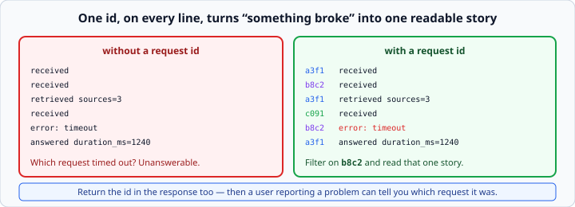
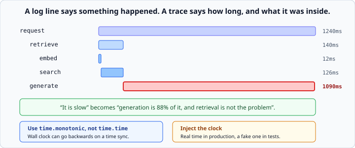

# Structured logging and tracing

*Week 11 · Day 3 · about 25 minutes*

> By the end of this you can answer "what happened at 3pm yesterday" from the logs alone.

---

## Read the official documentation first

| Page | What it gives you |
|---|---|
| [**`logging` — Logging facility**](https://docs.python.org/3.14/library/logging.html) | The module |
| [**Logging HOWTO**](https://docs.python.org/3.14/howto/logging.html) | The gentler introduction |
| [**Logging Cookbook**](https://docs.python.org/3.14/howto/logging-cookbook.html#implementing-structured-logging) | Structured logging specifically |
| [**`time.monotonic()`**](https://docs.python.org/3.14/library/time.html#time.monotonic) | Why not `time.time()` |
| [**`uuid`**](https://docs.python.org/3.14/library/uuid.html) | Generating a request id |
| [**Twelve-Factor — Logs**](https://12factor.net/logs) | Treat logs as an event stream |

---

## `print` does not survive contact with production

It goes to stdout, has no timestamp, no severity, and **no way to find one request among
thousands**.

Fine on your laptop. Useless the moment somebody else is using the thing.

---

## Structured logs are JSON, not sentences

```python
print("Answered question in 1.2s")                       # unsearchable
log("info", "answered", duration_ms=1200, sources=2)     # searchable
```

```json
{"ts": "2026-09-01T15:04:11Z", "level": "info", "event": "answered",
 "request_id": "a3f1c2", "duration_ms": 1200, "sources": 2}
```

The difference is that you can ask **"show me every request over 5000ms"** and get an
answer. With sentences you can only grep, and **grep cannot compare numbers.**

**Log events, not prose.** `"answered"` is an event. `"Successfully answered the user's
question!"` is prose with an event hidden in it.

A small logger is enough:

```python
import json, logging, sys, time

logger = logging.getLogger("app")

def log(level: str, event: str, **fields) -> None:
    """Emit one structured log line as JSON."""
    payload = {"ts": time.strftime("%Y-%m-%dT%H:%M:%SZ", time.gmtime()),
               "level": level, "event": event, **fields}
    logger.log(getattr(logging, level.upper()), json.dumps(payload))
```

Keep the event names **short and stable**: `received`, `retrieved`, `answered`,
`refused`, `error`. You will build dashboards and alerts on those strings, and renaming
one silently breaks everything downstream.

---

## The request id

```python
from uuid import uuid4

request_id = uuid4().hex[:12]
```

One id, generated when the request arrives, attached to **every** log line for that
request.



It is what turns *"something broke"* into *"here is the whole story of that one
request"*, and **it is the single highest-value thing on this page.**

Without it, a service handling ten requests a second produces logs that are interleaved
and unreadable — three "received" lines and one error, and no way to know which request
failed.

**Return it in the response too:**

```python
return AskResponse(answer=..., request_id=request_id)
```

Then a user reporting a problem can tell you exactly which request it was, and you find
it in one search. That is a two-line change that removes an entire category of "we
cannot reproduce it".

---

## Never log the secret

You masked it yesterday. The same rule applies to every log line, and **it is easier to
break here** — a helpful `log("debug", "calling", headers=headers)` puts your key in the
log service forever.

Other things that should not go in logs, for the same reason:

- the full question, if it might contain personal data — log its length instead
- the full answer — log its length and the source count
- anything a user pasted

**Log what you need to debug the system, not the contents of what people said to it.**
That is a privacy position and also a practical one: logs get shared far more widely than
databases.

---

## A trace is a tree of timings

A log line says something happened. A trace says **how long** it took and **what it was
inside**.



```
request                     1240ms
  retrieve                   140ms
    embed                     12ms
    search                   126ms
  generate                  1090ms
```

Now *"it is slow"* becomes *"generation is 88% of it, and retrieval is not the
problem"* — a completely different conversation, and the only one worth having about
performance.

Note what this saves you from: a week spent optimising retrieval that was never the
problem. **Measure before you optimise** is a rule everyone agrees with and almost nobody
follows, because without a trace they cannot.

```python
class Tracer:
    """Records nested named spans with durations."""

    def __init__(self, request_id: str, clock=time.monotonic) -> None:
        self.request_id = request_id
        self.clock = clock
        self.spans: list[dict] = []
        self._stack: list[dict] = []

    @contextmanager
    def span(self, name: str):
        entry = {"name": name, "depth": len(self._stack), "start": self.clock()}
        self._stack.append(entry)
        try:
            yield entry
        finally:
            self._stack.pop()
            entry["duration_ms"] = round((self.clock() - entry["start"]) * 1000, 1)
            self.spans.append(entry)
```

```python
with tracer.span("request"):
    with tracer.span("retrieve"):
        results = store.search(question)
    with tracer.span("generate"):
        answer = call_model(results)
```

Week 3's `with` and week 4's classes, doing something genuinely useful. The `finally`
means a span is recorded **even when the code inside raises** — which is exactly when you
most want to know how long it ran before failing.

---

## Timing needs an injected clock

```python
tracer = Tracer(request_id, clock=time.monotonic)
```

Real time in production, a fake clock in tests. **Dependency injection, for the fourth
time** — and here it is the only way to write a test about durations that is not flaky.

```python
def test_span_records_duration():
    ticks = iter([0.0, 1.5])
    tracer = Tracer("test", clock=lambda: next(ticks))
    with tracer.span("work"):
        pass
    assert tracer.spans[0]["duration_ms"] == 1500.0
```

A test asserting "this took about 1.5 seconds" by actually sleeping is slow and flaky.
A test with a fake clock is instant and exact.

### Use `time.monotonic`, not `time.time`

Wall-clock time can go **backwards** when the machine syncs with a time server, and a
negative duration in a chart is a genuinely confusing half hour.

`time.monotonic` only ever goes forwards. Use it for measuring elapsed time, always. Use
`time.time` only for timestamps you want a human to read.

---

## What to log for an LLM service

Beyond the usual, log the things specific to this kind of system:

| Field | Why |
|---|---|
| `model` | so you find out production is on the wrong one |
| `input_tokens`, `output_tokens` | cost per request, from `usage` |
| `cost_usd` | the number a manager will ask for |
| `tool_calls` | how many steps the agent took |
| `stop_reason` | truncation is invisible otherwise |
| `refused` | your refusal rate is a quality signal |
| `sources` | how many chunks the answer used |

**Cost per request is the one people wish they had logged.** Without it, "why is the bill
so high" is unanswerable; with it, it is a sort.

---

## Then read about the real ones

LangSmith, Langfuse and OpenTelemetry all do this properly and you should use one at
work.

You wrote a small one first for the same reason you wrote the agent loop: **so that when
you open LangSmith it looks like a nicer version of something you already understand,
rather than a magic dashboard.**

It is about forty lines. Then go and read what LangSmith offers and notice how much of it
you now recognise: spans, nesting, durations, a run id, structured fields on each step.
What they add is storage, a UI, sampling, and the ability to compare runs — all genuinely
worth paying for, and none of it conceptually new to you now.

---

## Check yourself

1. Why is `log("info", "answered", duration_ms=1200)` better than
   `print("Answered in 1.2s")`?
2. What is the request id for, and where else should it appear?
3. Why `time.monotonic` rather than `time.time`?
4. Your trace shows `retrieve` at 140ms and `generate` at 1090ms. What do you optimise?

<details>
<summary>Answers</summary>

1. It is **queryable**. "Every request over 5000ms" is a filter on a number, not a text
   search. Grep cannot compare numbers.
2. Correlating every log line for one request. It should also be **in the response**, so
   a user reporting a problem can tell you which request to look at.
3. Wall-clock time can jump backwards on a time sync, producing negative durations.
   Monotonic time only goes forwards.
4. **Generation, or nothing.** Retrieval is 11% — halving it saves 70ms out of 1240.
   Before touching generation, ask whether 1.2s is actually a problem; the trace tells
   you where the time is, not whether it matters.
</details>

---

## What you can now do

- [ ] Emit structured JSON logs with short, stable event names
- [ ] Explain why events beat prose
- [ ] Generate a request id, attach it to every line, and return it to the caller
- [ ] Keep secrets and user content out of logs
- [ ] Build a nested tracer with a context manager and a `finally`
- [ ] Inject a clock so duration tests are exact and fast
- [ ] Use `time.monotonic` and say why
- [ ] Log the LLM-specific fields, including cost per request
- [ ] Recognise what LangSmith adds on top of what you built

**Next:** [LLM evaluation and guardrails](../day-4/evaluation-and-guardrails.md) —
stopping a bad change reaching production.
