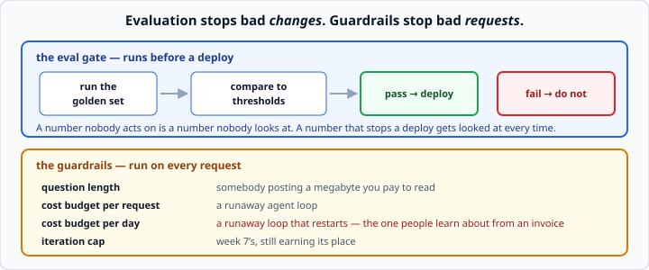

# LLM evaluation and guardrails

*Week 11 · Day 4 · about 25 minutes*

> By the end of this a bad change cannot reach production, and a runaway request cannot
> empty your account.

---

## Read the official documentation first

| Page | What it gives you |
|---|---|
| [**Create strong empirical evaluations**](https://docs.claude.com/en/docs/test-and-evaluate/develop-tests) | Building the eval set |
| [**Define your success criteria**](https://docs.claude.com/en/docs/test-and-evaluate/define-success) | Choosing thresholds |
| [**Reduce hallucinations**](https://docs.claude.com/en/docs/test-and-evaluate/strengthen-guardrails/reduce-hallucinations) | The guardrail side |
| [**Structured outputs**](https://docs.claude.com/en/docs/build-with-claude/structured-outputs) | Making the judge return parseable JSON |
| [**pytest**](https://docs.pytest.org/en/stable/) | The gate is a test |

---

## Week 9's harness, wired to the deploy

You already measure retrieval. **The step nobody takes is making that measurement block
something.**



```
run the golden set  ->  compare to thresholds  ->  pass: deploy.  fail: do not.
```

**A number nobody acts on is a number nobody looks at.** A number that stops a deploy
gets looked at every single time.

That sentence is most of the value of today. Plenty of teams have an eval script. Very
few have one that can say no.

---

## Judging the answer, not just the retrieval

Hit rate says the right passage was fetched. It says nothing about whether the answer
built from it was any good.

For that you need a judge, and the usual judge is another model call:

```python
JUDGE_SYSTEM = """You are grading an answer against a reference.

Score 1 to 5:
5 - correct and complete
3 - correct but missing something important
1 - wrong, or contradicts the reference

Return only JSON: {"score": <1-5>, "reason": "<one sentence>"}"""
```

Week 6's structured output, doing a new job. And week 6's defences apply unchanged:
extract the JSON, validate it with pydantic, retry with the error fed back.

```python
class Judgement(BaseModel):
    score: int = Field(ge=1, le=5)
    reason: str
```

`ge=1, le=5` matters. A judge that returns `7` should fail loudly, not quietly skew your
average.

### Be honest about what this is

An LLM judge is cheap, fast, and **agrees with a human often but not always**.

- **Good for** catching a regression between two versions of your own system.
- **Bad as** a claim about absolute quality.

The way to use it is **comparatively** — *"version B scored worse than version A on the
same questions"* — which is exactly what a deploy gate needs anyway.

Anyone quoting an LLM-judge score as an absolute measure of quality is overselling it,
and being able to say why is worth something in an interview.

Two practical notes:

- **Give the judge the reference answer**, not just the question. Judging without a
  reference is much less reliable.
- **Do not judge with the same prompt that generated.** A model grading its own work in
  the same framing is generous.

---

## Thresholds, decided in advance

```python
THRESHOLDS = {
    "hit_rate": 0.80,
    "mean_score": 3.5,
    "refusal_rate": 0.20,
}
```

**Set them before you run**, or you will find yourself lowering one to get a deploy out.
Everybody does it once.

Commit them to the repository. A threshold in a file with a git history is a decision
somebody has to justify changing; a threshold in your head is not a threshold.

### The refusal rate cuts both ways

Include it **in both directions**:

- **too low** — the system is making things up rather than saying "I don't know"
- **too high** — it is useless, refusing things it could answer

```python
if refusal_rate > 0.30:
    fail("refusing too much — retrieval may have regressed")
if refusal_rate < 0.05:
    fail("refusing too little — check the refusal path still works")
```

**A gate that only measures success misses half of what can go wrong.** A change that
broke the refusal path entirely would raise your hit rate and your mean score, and be
much worse.

---

## The gate

```python
def gate(results: dict, thresholds: dict) -> dict:
    """Compare measured results to thresholds. Returns pass/fail and the failures."""
    failures = [
        f"{name}: {results[name]:.2f} < {limit:.2f}"
        for name, limit in thresholds.items()
        if results.get(name, 0) < limit
    ]
    return {"passed": not failures, "failures": failures}
```

```python
def test_eval_gate():
    results = run_golden_set(app)
    verdict = gate(results, THRESHOLDS)
    assert verdict["passed"], verdict["failures"]
```

**Make it a test.** Then it runs where your other tests run, it fails the same way, and
nobody has to remember a separate script.

`assert verdict["passed"], verdict["failures"]` puts the failures in the assertion
message, so the output names what fell short rather than saying `False is not True`.
Week 4's "name a test so its failure explains itself", applied to a gate.

### Report, do not just fail

```
EVAL RESULTS
  hit_rate      0.85  (>= 0.80)  PASS
  mean_score    3.20  (>= 3.50)  FAIL
  refusal_rate  0.15  (<= 0.30)  PASS

FAILED: mean_score 3.20 < 3.50
Worst questions:
  - "what happens if I ignore the pager"  score 1  "answer contradicts the reference"
```

The number tells you *whether*. **The worst questions tell you why**, and that is where
the work is — exactly as it was in week 9.

---

## Guardrails

Evaluation stops bad **changes**. Guardrails stop bad **requests**.

| Guard | Stops |
|---|---|
| Question length | somebody posting a megabyte you pay to read |
| Cost budget per request | a runaway agent loop |
| Cost budget per day | a runaway agent loop **that restarts** |
| Iteration cap | week 7's, still earning its place |

### The daily budget

**This is the one people skip and then learn about from an invoice.**

```python
class Budget:
    """Tracks spend against a daily cap."""

    def __init__(self, daily_limit_usd: float) -> None:
        self.daily_limit = daily_limit_usd
        self.spent_today = 0.0

    def check(self) -> None:
        if self.spent_today >= self.daily_limit:
            raise HTTPException(
                status_code=503,
                detail="Daily cost budget reached. Service will resume tomorrow.",
            )

    def record(self, cost_usd: float) -> None:
        self.spent_today += cost_usd
```

Track what you spend, refuse when you are over, and **log the refusal loudly** — a
service that silently stops answering is worse than one that says why.

Note the **503**, not a 500. This is a temporary, deliberate refusal by a working
service, and 503 is what tells a caller it is worth trying later. Week 5's status-code
table, from the other side, one last time.

### Per-request cost cap

```python
if tracer.cost_usd > settings.max_cost_per_request:
    log("warn", "cost_cap_hit", request_id=request_id, cost_usd=tracer.cost_usd)
    return partial_answer_with_note()
```

Week 7's agent cap, now with a number attached. One runaway loop should cost you pennies,
not the afternoon's budget.

### Input guardrails you already have

Yesterday's `max_length=500` on the request model is a guardrail. So is `ge=1, le=10` on
`k`. **Pydantic is doing guardrail work before your code runs**, which is the cheapest
possible place to do it.

---

## What guardrails do not do

They bound **cost** and **chaos**. They do not make the system **correct** — week 7's
lesson, and it still holds.

A guardrail cannot stop a confidently wrong answer. Only evaluation catches that, and
only against a golden set you wrote.

That is why both halves of today exist, and why neither substitutes for the other:

- **guardrails** — bound the damage of a bad request
- **evaluation** — stop a bad version reaching users at all

---

## What to put in the README

Week 4's README lesson, applied to Project 3:

```markdown
## Evaluation

`pytest tests/test_eval.py` runs a 20-question golden set against the service and
fails if hit rate drops below 0.80 or the mean judged score below 3.5.

Current: hit@3 = 0.85, mean score = 3.7, refusal rate = 0.15.

## Guardrails

- Questions capped at 500 characters
- $0.05 per request, $5.00 per day; returns 503 when exceeded
- Agent capped at 5 iterations
```

**Almost no junior portfolio has that section.** It is four sentences and it says you
have thought about cost, quality and failure — which is exactly what week 12's interviews
are about.

---

## Check yourself

1. Why make the eval a test rather than a script?
2. Why include a *minimum* refusal rate?
3. Your LLM judge gives version B a mean of 3.9 and version A 3.4. What can you claim?
4. Why does the budget guard return 503 and not 500?

<details>
<summary>Answers</summary>

1. So it runs where the other tests run, fails the same way, and cannot be forgotten. A
   separate script is a script somebody stops running.
2. Because a change that **broke the refusal path** would raise your hit rate and your
   score while making the system much worse — it would answer everything, including
   things it has no basis for. A gate measuring only success misses that entirely.
3. That **B scored better than A on those questions with that judge** — a useful
   comparative signal. Not that B is "78% good", and not that B is better in general.
   Comparative claims are the ones an LLM judge supports.
4. **503 means "temporarily unavailable, try later"**, which is exactly true. A 500 says
   "something broke", which would send someone debugging a system that is working
   correctly and deliberately.
</details>

---

## What you can now do

- [ ] Wire a golden set to a deploy gate that can say no
- [ ] Write an LLM judge with structured, validated output
- [ ] State honestly what an LLM judge can and cannot claim
- [ ] Set thresholds in advance and commit them
- [ ] Include refusal rate in both directions
- [ ] Make the gate a test whose failure names what fell short
- [ ] Report the worst questions, not just the number
- [ ] Implement per-request and per-day cost budgets, returning 503
- [ ] Say what guardrails do not protect you from

**Next:** the week 11 milestone — **Project 3**, deployed, traced and evaluated. This is
the claim that closes offers.
