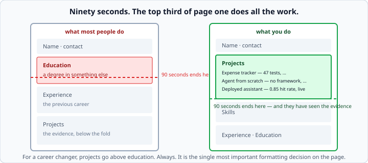
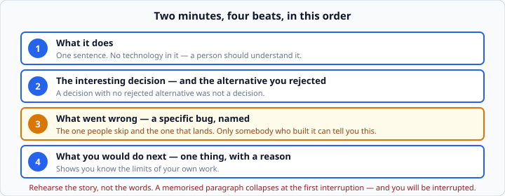

# Résumés for career changers

*Week 12 · Day 1 · about 20 minutes*

> By the end of this your résumé and GitHub survive a ninety-second read, and you can
> tell each project's story in two minutes.

---

## Read these first

There is no official documentation for this one — it is not a language feature, and
anyone claiming a definitive standard is selling a template. **Your own artefacts are
the source material.**

| Source | What it gives you |
|---|---|
| Your three project READMEs | The raw material for every line below — week 4 taught you to write them |
| `week-04/milestone/`, `week-07/milestone/`, `week-11/milestone/` | What each project actually proves |
| [**GitHub — Managing your profile README**](https://docs.github.com/en/account-and-profile/setting-up-and-managing-your-github-profile/customizing-your-profile/managing-your-profile-readme) | Pinning repositories and the profile page |
| [**GitHub — About READMEs**](https://docs.github.com/en/repositories/managing-your-repositorys-settings-and-features/customizing-your-repository/about-readmes) | Where a README renders and how |
| `ai/interviewer.md` | The course's interviewer role, for rehearsing the stories |

Before writing anything, **re-read your own week 4 README article**. Everything there —
one sentence on what it is, run instructions that work from a cold clone, an honest
"what I would do next" — is exactly what today asks of a résumé line.

---

## Ninety seconds

That is roughly how long a first read gets. **Not because people are lazy — because
there are two hundred of you and one of them.**

So the top third of page one does the work.



For a career changer that means **projects above education**, always.

Your three projects are the **evidence**. A bootcamp certificate or a degree in
something else is **context**. Evidence goes first; context goes at the bottom where
somebody who is already interested will find it.

This is the single most important formatting decision on the page, and most people get
it wrong because every résumé template they have ever seen was designed for someone
whose degree *was* the evidence.

---

## One line per project, and it says what it does

| Weak | Strong |
|---|---|
| "Built an AI agent using Python and LangChain" | "Agent that answers questions from a document set, hand-written tool loop then ported to LangGraph — 0.85 retrieval hit rate, deployed" |

The second one has **a number, a decision, and something checkable** in it.

The first could have been written by somebody who watched a tutorial, and the reader
knows that. Half the applications they read that morning said something almost
identical.

### What makes a line strong

**A number.** `47 tests`, `0.85 hit rate`, `3.2× cost difference`, `1,497 tests passing`.
Numbers cannot be bluffed, and they are the fastest possible signal that you measured
something.

**A decision.** "hand-written loop then ported to LangGraph" says you made a choice and
can discuss it. "using LangChain" says you followed a tutorial.

**Something checkable.** "deployed" with a link. "on GitHub" with a repository that
opens well.

**No adjectives.** "robust", "scalable", "production-ready" and "cutting-edge" are worth
nothing — the reader discounts them automatically, and they take the space a number
would have used.

### Your three, roughly

| Project | What it proves |
|---|---|
| **Expense Tracker** (week 4) | you can write Python, not assemble it |
| **Agent From Scratch** (week 7) | you understand agents rather than importing them |
| **Deployed Assistant** (week 11) | you can ship — the claim that closes offers |

**The middle one is your differentiator.** Everybody has used an agent framework. Almost
nobody has written the loop, ported it, and can compare the two with line counts. Say
that explicitly.

---

## The GitHub profile

**The first three pinned repositories are your portfolio. Everything else is noise.**

Pin exactly those three. An unpinned profile shows your most recently updated
repositories, which is usually a half-finished experiment and a fork of somebody's
dotfiles.

For each one:

- a README that opens with **what it is**, in one sentence
- **commands that work from a cold clone** — actually test this, in a fresh directory
- a **live link** if there is one
- **commits that read like somebody building something**, not one commit called "stuff"

**An interviewer who opens a repository and cannot tell what it does in fifteen seconds
closes it.** That is not unfair; it is the same fifteen seconds you would give.

### The cold-clone test

```bash
cd /tmp && git clone <your-repo> check && cd check
# now follow your own README, literally
```

The most common failure is instructions that only work on the author's machine, because
they forget the step they did six weeks ago. Five minutes to check, and it is the
difference between a reader trying your project and a reader closing the tab.

### The commit history

Somebody will scroll it. A history of small, described commits reads as somebody working;
a single commit called "final" reads as somebody who pasted a finished thing in.

You have been committing daily since week 1. **That history is an asset** — do not
squash it away.

---

## The project story

Two minutes, four beats, in this order.



**1. What it does** — one sentence, no technology. If a non-programmer cannot follow it,
rewrite it.

**2. The interesting decision** — and the alternative you rejected. A decision with no
rejected alternative was not a decision; it was a default.

**3. What went wrong** — a specific bug, named.

**4. What you would do next** — one thing, with a reason.

### Beat 3 is the one that lands

It is also the one people skip, because it feels like admitting weakness.

**Everybody's project worked in the demo. Only somebody who built it can tell you exactly
how it broke.** That is the single most reliable signal an interviewer has, and you have
a whole course of material for it:

- the accumulator reset inside the loop, which gave a plausible wrong total with no error
- the agent that repeated the same tool call five times before the cap stopped it
- the chunk boundary that split the answer across two chunks so no search could find it
- the `.env` that nearly went into the Docker image

Name the symptom, say how you found it, say what you changed. Thirty seconds.

Your `NOTES.md` files from every debugging day are exactly this, already written down.
**That is what they were for.**

### Rehearse the story, not the words

A memorised paragraph collapses at the first interruption, and **you will be
interrupted** — usually in the middle of beat 2, with a question about beat 3.

Know the four beats. Say them differently every time you practise. If you can only tell
it one way, you have memorised a script rather than understood the project.

---

## Checking your own line

The exercise asks you to write a checker, which is a useful discipline:

```python
def check(project: dict) -> dict:
    """Return {"ok": bool, "problems": [...]} for one project's story."""
    problems = []

    if not any(char.isdigit() for char in project["one_line"]):
        problems.append("one_liner has no number in it")

    for beat in ("one_line", "decision", "alternative", "broke", "next_step"):
        if len(project[beat].split()) < 8:
            problems.append(f"{beat} is too short to be specific")

    return {"ok": not problems, "problems": problems}
```

**Judgement, written down as code** — the same move as week 10's `assess`. It stops the
standard drifting when you are tired, and it makes the criteria arguable rather than
vague.

The "no number" check is the one that catches most people. Write your line, run the
check, and notice how often the honest answer is that you did not measure anything.

If so, go and measure it. You have the harnesses from weeks 9 and 11 already.

---

## What not to do

**Do not list every technology you have touched.** A skills section with forty entries
says you can recognise forty logos.

**Do not claim a level you cannot defend.** "Expert in LangGraph" invites a question you
will not enjoy. Say what you built.

**Do not hide the career change.** It is on the page anyway, and treating it as
embarrassing is worse than treating it as a fact. Your previous career is where your
judgement, your writing and your ability to talk to people came from — those are the
things juniors are usually missing.

**Do not use a template with a photo, a skills bar chart, or a "profile" paragraph.**
Nobody reads the paragraph, and a bar chart claiming "Python 80%" is not a measurement.

---

## Check yourself

Rewrite this line so it would survive:

> "Developed a RAG chatbot using Python, LangChain, and vector databases."

<details>
<summary>One good answer</summary>

> "Question-answering service over a document set — measured retrieval with a 20-question
> golden set and improved hit rate from 0.65 to 0.85 by changing the chunking. Deployed,
> traced, with an eval gate that blocks a bad deploy. [link]"

What changed:

- **Two numbers**, and the delta between them — which shows a controlled comparison, not
  a claim.
- **A decision named** — the chunking change — and it is discussable.
- **The unglamorous parts included**: measurement, tracing, the gate. Almost nobody has
  those, and they are the ones an experienced engineer notices.
- **A link.**
- **The technology list is gone.** It is in the repository, and the interviewer will ask.

It is longer. That is fine — it is one of three lines in the section that gets read.
</details>

---

## What you can now do

- [ ] Put projects above education and say why
- [ ] Write a project line with a number, a decision and something checkable
- [ ] Say which of your three projects is the differentiator, and why
- [ ] Pin three repositories and audit each one's first fifteen seconds
- [ ] Run the cold-clone test on your own instructions
- [ ] Tell a two-minute story in four beats
- [ ] Name a specific bug from your own work, with the symptom and the fix
- [ ] Rehearse the beats rather than the words
- [ ] Check your own lines against explicit criteria

**Next:** the rest of week 12 — ten recorded mock interviews, scored. It is the week
people underestimate.
